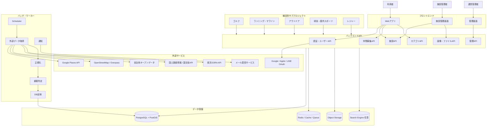
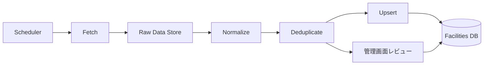
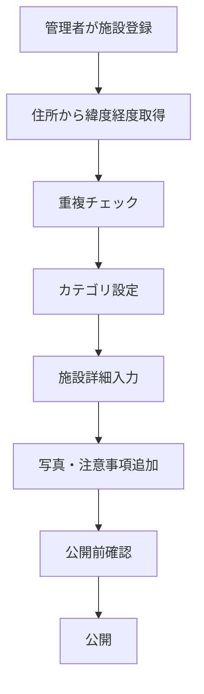
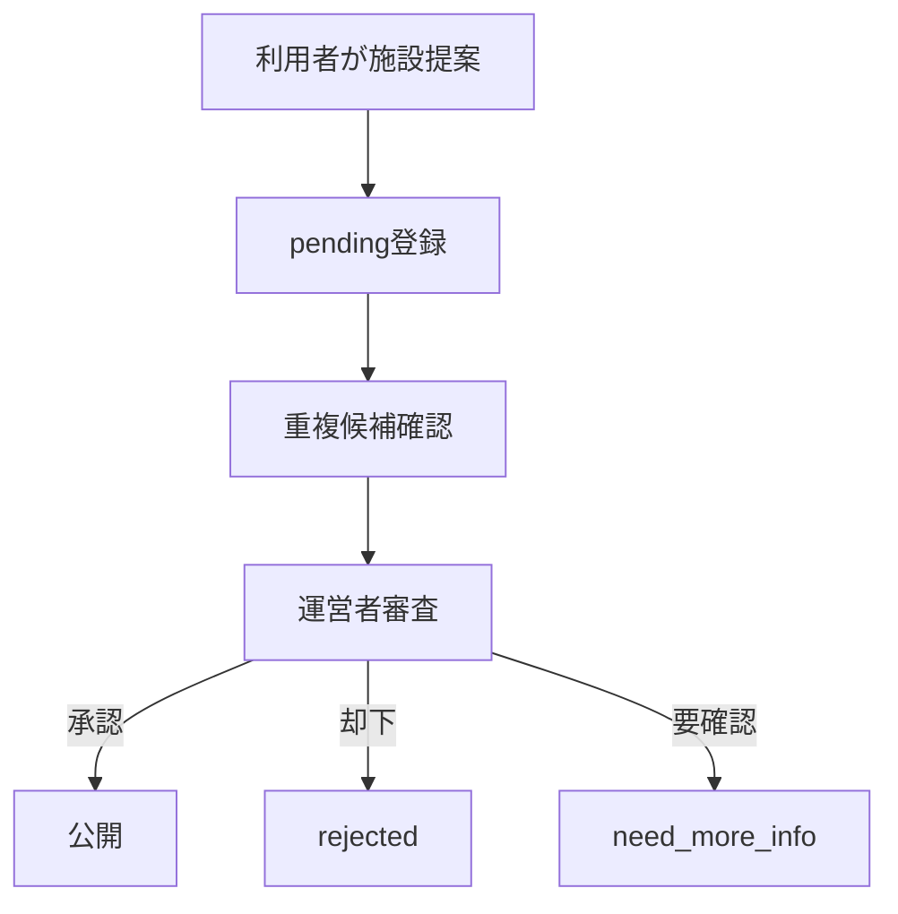
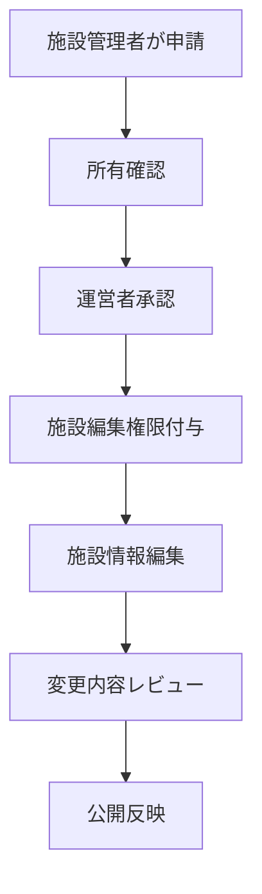
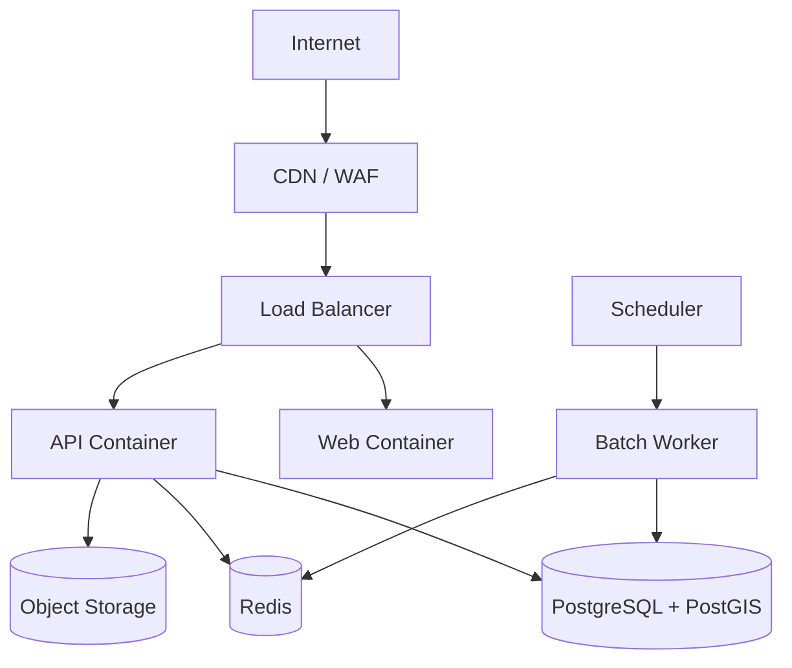

# スポーツ・レジャー仲間募集サービス システム構成設計書

- 対象サービス: Spotomo / Lykuro 系スポーツ・レジャー仲間募集サービス
- 対象範囲: スポーツ施設、レジャー施設、アウトドア施設、仲間募集、施設検索、手動登録、外部データ取得バッチ
- 作成日: 2026-06-25
- 版数: v1.0
- 関連資料: `sports_leisure_facility_data_design_v1_2.md`

---

## 1. 目的

本設計書は、スポーツ・レジャー仲間募集サービスにおけるシステム全体構成を定義する。

対象サービスでは、ユーザーが以下を行えることを目的とする。

```text
スポーツ・レジャー施設を検索する
施設を指定して仲間募集を作成する
ゴルフ・ランニング・アウトドア等、複数種目の募集に参加する
利用者または施設管理者が施設情報を提案・登録する
運営者が施設情報を承認・修正・公開する
外部API・オープンデータから施設情報を定期取得する
```

本設計では、将来的に種目ごとに独立したドメイン・サブプロジェクトを運用できるよう、**共通基盤 + 種目別アプリ** の構成を採用する。

---

## 2. 基本方針

### 2.1 システム方針

```text
1. ユーザー管理・認証は共通基盤で一元管理する
2. ゴルフ、ランニング、アウトドア等の種目別機能はサブプロジェクト化する
3. 施設データは共通 facilities DB で管理する
4. 外部データ取得はバッチ処理で行う
5. 施設検索・仲間募集表示は自社DBを参照する
6. 予約URL、料金、注意事項など変動情報は手動補完を許可する
7. 利用者登録情報は承認フローを通して公開する
8. 位置情報検索は PostGIS を前提に設計する
```

### 2.2 システム構成の考え方

| 区分 | 方針 |
|---|---|
| フロントエンド | ユーザー画面、管理画面、施設管理画面を分離可能にする |
| バックエンド | 共通API + 種目別APIの構成 |
| 認証 | 共通認証基盤。Google / Apple / LINE 等のOAuthを利用可能にする |
| データベース | PostgreSQL + PostGIS を基本とする |
| 外部施設データ | Google Places、OSM、自治体オープンデータ、国土数値情報、楽天GORA等から取得 |
| バッチ処理 | 定期実行で取得、正規化、重複判定、DB反映 |
| 手動登録 | 管理者・施設管理者・利用者の登録申請を受け付ける |
| 検索 | 初期はPostgreSQL検索。必要に応じてMeilisearch / OpenSearchを追加 |
| 画像 | 施設写真、プロフィール画像、募集画像をオブジェクトストレージに保存 |
| 通知 | メール、LINE、アプリ内通知を段階的に追加 |

---

## 3. 全体構成

### 3.1 全体アーキテクチャ



---

## 4. サブシステム構成

### 4.1 ユーザー向けWebアプリ

利用者が施設検索、仲間募集検索、募集作成、参加申請を行う画面。

主な機能:

```text
トップページ
種目別ページ
施設検索
現在地・地域検索
仲間募集一覧
仲間募集詳細
募集作成
参加申請
プロフィール管理
お気に入り
フォロー / フォロワー
通知一覧
```

想定URL例:

```text
https://spotomo.lykuro.ai/
https://spotomo.lykuro.ai/golf
https://spotomo.lykuro.ai/running
https://spotomo.lykuro.ai/outdoor
https://spotomo.lykuro.ai/facilities/{facility_id}
https://spotomo.lykuro.ai/recruitments/{recruitment_id}
```

### 4.2 種目別サブプロジェクト

種目ごとにUI、検索条件、施設属性、募集項目が異なるため、サブプロジェクトとして分離可能にする。

| サブプロジェクト | 主な対象 |
|---|---|
| golf | ゴルフ場、ゴルフ練習場、ラウンド募集、練習仲間 |
| running | ランニング、マラソン、陸上競技場、ランニングコース |
| outdoor | キャンプ、登山、BBQ、釣り、SUP、カヤック |
| sports | サッカー、フットサル、野球、テニス、バスケ、バレー等 |
| fitness | ジム、ヨガ、ダンス、武道、格闘技 |
| leisure | ボウリング、ダーツ、ビリヤード、カラオケ等 |

初期段階では単一リポジトリ内のモジュール分割でもよい。将来的にはドメイン別・アプリ別に分割できる構造にする。

```text
apps/
  web/
  admin/
  owner/
  golf/
  running/
  outdoor/
packages/
  ui/
  auth/
  api-client/
  category-master/
  facility-types/
services/
  api/
  batch/
  worker/
```

### 4.3 管理画面

運営者が施設、カテゴリ、募集、ユーザー、通報、承認を管理する画面。

主な機能:

```text
施設一覧
施設詳細
施設新規登録
施設編集
施設重複候補確認
外部取得データ確認
施設公開・非公開
利用者提案の承認・却下
カテゴリ管理
仲間募集管理
ユーザー管理
通報管理
運営メモ
データ取得バッチ実行履歴
```

### 4.4 施設管理者画面

施設オーナーや運営団体が、自施設情報を編集・申請できる画面。

主な機能:

```text
施設管理者申請
施設所有確認
施設情報編集
写真登録
料金・営業時間更新
予約URL登録
休業情報登録
運営者への承認申請
```

---

## 5. バックエンドAPI構成

### 5.1 API分類

| API | 役割 |
|---|---|
| Auth API | ログイン、OAuth、セッション、権限管理 |
| User API | プロフィール、フォロー、通知設定 |
| Facility API | 施設検索、施設詳細、施設登録、施設提案 |
| Category API | 種目、カテゴリ、施設種別マスター |
| Recruitment API | 仲間募集作成、検索、参加申請、コメント |
| Admin API | 承認、審査、非公開、通報対応 |
| Owner API | 施設管理者向け編集・申請 |
| Batch API | バッチ実行状態、取得ログ、エラー確認 |
| Upload API | 画像・ファイルアップロード |
| Notification API | メール、LINE、アプリ内通知 |

### 5.2 APIエンドポイント例

#### 施設検索

```http
GET /api/facilities?category=golf&prefecture=tokyo
GET /api/facilities?category=camp&lat=35.6812&lng=139.7671&radius=30000
GET /api/facilities?keyword=テニス&city=世田谷区
```

#### 施設詳細

```http
GET /api/facilities/{facility_id}
```

#### 施設登録・提案

```http
POST /api/facilities/proposals
PUT /api/facilities/proposals/{proposal_id}
POST /api/admin/facilities/{facility_id}/approve
POST /api/admin/facilities/{facility_id}/reject
```

#### 仲間募集

```http
GET /api/recruitments?category=golf&date_from=2026-07-01
POST /api/recruitments
GET /api/recruitments/{recruitment_id}
POST /api/recruitments/{recruitment_id}/join
POST /api/recruitments/{recruitment_id}/cancel
```

#### 管理画面

```http
GET /api/admin/facilities?status=pending
GET /api/admin/facilities/duplicates
POST /api/admin/facilities/{facility_id}/merge
GET /api/admin/batch-runs
```

---

## 6. データベース構成

### 6.1 主要テーブル

```text
users
user_profiles
user_auth_accounts
sports_categories
facility_categories
facilities
facility_sources
facility_proposals
facility_images
facility_owners
recruitments
recruitment_participants
recruitment_comments
favorites
follows
notifications
reports
batch_runs
batch_run_logs
```

### 6.2 facilities

```sql
CREATE TABLE facilities (
  id BIGSERIAL PRIMARY KEY,

  name TEXT NOT NULL,
  name_kana TEXT,
  normalized_name TEXT,

  category TEXT NOT NULL,
  sub_category TEXT,
  sports_type TEXT,

  address TEXT,
  prefecture TEXT,
  city TEXT,
  postal_code TEXT,
  latitude DOUBLE PRECISION,
  longitude DOUBLE PRECISION,
  geom GEOGRAPHY(POINT, 4326),

  phone TEXT,
  website_url TEXT,
  reservation_url TEXT,
  description TEXT,

  opening_hours TEXT,
  closed_days TEXT,
  business_period TEXT,
  price_info TEXT,

  has_parking BOOLEAN DEFAULT false,
  has_toilet BOOLEAN DEFAULT false,
  has_shower BOOLEAN DEFAULT false,
  has_locker BOOLEAN DEFAULT false,
  has_rental BOOLEAN DEFAULT false,
  has_shop BOOLEAN DEFAULT false,

  indoor BOOLEAN,
  outdoor BOOLEAN,
  beginner_friendly BOOLEAN DEFAULT false,
  family_friendly BOOLEAN DEFAULT false,
  pet_allowed BOOLEAN DEFAULT false,

  source_priority TEXT,
  status TEXT DEFAULT 'pending',
  verified BOOLEAN DEFAULT false,
  verified_at TIMESTAMP,
  last_checked_at TIMESTAMP,

  created_by BIGINT,
  updated_by BIGINT,
  created_at TIMESTAMP DEFAULT now(),
  updated_at TIMESTAMP DEFAULT now()
);
```

推奨インデックス:

```sql
CREATE INDEX idx_facilities_category ON facilities(category);
CREATE INDEX idx_facilities_pref_city ON facilities(prefecture, city);
CREATE INDEX idx_facilities_status ON facilities(status);
CREATE INDEX idx_facilities_geom ON facilities USING GIST(geom);
CREATE INDEX idx_facilities_normalized_name ON facilities(normalized_name);
```

### 6.3 facility_sources

外部API・オープンデータの取得元を保存する。

```sql
CREATE TABLE facility_sources (
  id BIGSERIAL PRIMARY KEY,
  facility_id BIGINT REFERENCES facilities(id),

  source_type TEXT NOT NULL,
  source_id TEXT,
  source_name TEXT,
  source_url TEXT,
  license TEXT,

  raw_data JSONB,
  fetched_at TIMESTAMP DEFAULT now(),
  created_at TIMESTAMP DEFAULT now()
);
```

source_type例:

```text
google_places
openstreetmap
municipal_open_data
mlit_national_land
rakuten_gora
manual_admin
manual_owner
manual_user
```

### 6.4 facility_proposals

利用者・施設管理者からの施設提案を管理する。

```sql
CREATE TABLE facility_proposals (
  id BIGSERIAL PRIMARY KEY,

  proposed_by BIGINT,
  proposal_type TEXT NOT NULL,
  target_facility_id BIGINT,

  name TEXT NOT NULL,
  category TEXT,
  sub_category TEXT,
  address TEXT,
  latitude DOUBLE PRECISION,
  longitude DOUBLE PRECISION,
  phone TEXT,
  website_url TEXT,
  reservation_url TEXT,
  description TEXT,

  proposal_status TEXT DEFAULT 'pending',
  reviewed_by BIGINT,
  reviewed_at TIMESTAMP,
  review_comment TEXT,

  created_at TIMESTAMP DEFAULT now(),
  updated_at TIMESTAMP DEFAULT now()
);
```

proposal_type例:

```text
new_facility
edit_facility
claim_owner
close_facility
wrong_info
```

proposal_status例:

```text
pending
approved
rejected
need_more_info
duplicate
```

### 6.5 recruitments

仲間募集情報を管理する。

```sql
CREATE TABLE recruitments (
  id BIGSERIAL PRIMARY KEY,

  title TEXT NOT NULL,
  description TEXT,

  category TEXT NOT NULL,
  sub_category TEXT,
  facility_id BIGINT REFERENCES facilities(id),

  event_date DATE,
  start_time TIME,
  end_time TIME,

  prefecture TEXT,
  city TEXT,
  meeting_place TEXT,
  latitude DOUBLE PRECISION,
  longitude DOUBLE PRECISION,

  max_participants INT,
  current_participants INT DEFAULT 0,
  participation_fee TEXT,

  visibility TEXT DEFAULT 'public',
  status TEXT DEFAULT 'open',

  created_by BIGINT NOT NULL,
  created_at TIMESTAMP DEFAULT now(),
  updated_at TIMESTAMP DEFAULT now()
);
```

status例:

```text
open
closed
cancelled
completed
hidden
reported
```

---

## 7. 外部データ取得バッチ構成

### 7.1 バッチ処理方針

施設マスターデータはリアルタイム取得ではなく、定期バッチで取得して自社DBに保存する。

```text
外部API / オープンデータ
↓
取得バッチ
↓
一時保存
↓
正規化
↓
重複判定
↓
承認待ちまたは自動反映
↓
facilities DB
↓
ユーザー画面・管理画面で利用
```

### 7.2 バッチ種別

| バッチ | 内容 | 推奨頻度 |
|---|---|---|
| Google Places取得 | 営業施設、店舗系、スポーツ施設を取得 | 週1回 |
| OSM取得 | 公園、自然系、コース、補助施設を取得 | 週1回〜月1回 |
| 自治体データ取得 | 公共施設、公園、体育施設、観光施設を取得 | 週1回〜月1回 |
| 国土数値情報取得 | 都市公園、自然公園、文化施設等を取得 | 月1回〜数か月に1回 |
| 楽天GORA取得 | ゴルフ場、予約導線を取得 | 週1回 |
| 正規化バッチ | カラム、カテゴリ、住所、名称を正規化 | 取得後 |
| 重複判定バッチ | 同一施設候補を抽出 | 取得後 |
| 閉鎖確認バッチ | 閉鎖、非公開、重複、古い情報を確認 | 月1回 |

### 7.3 バッチ処理フロー



### 7.4 データ取得元

| 取得元 | 主な対象 |
|---|---|
| Google Places API | ゴルフ場、ジム、スタジアム、スポーツ施設、レジャー施設、カラオケ、ボウリング等 |
| OpenStreetMap / Overpass API | 公園、登山口、ルート、トイレ、駐車場、スポーツコート、自然系POI |
| 自治体オープンデータ | 公共施設、体育館、公園、運動場、観光施設、公衆トイレ、駐車場 |
| 国土数値情報 / 国交省API | 都市公園、自然公園区域、文化施設、スポーツ施設候補 |
| 楽天GORA API | ゴルフ場、予約URL、プラン情報 |
| 自社登録 | 集合場所、利用者提案、施設管理者登録、予約URL、料金、注意事項 |

---

## 8. 重複判定設計

### 8.1 重複が発生する理由

同じ施設が複数の取得元に存在する。

例:

```text
Google Places: ○○キャンプ場
OSM: ○○ Camp Site
自治体データ: ○○オートキャンプ場
自社登録: ○○キャンプ場 予約ページあり
```

### 8.2 判定条件

```text
施設名が近い
緯度経度が100m以内
住所が近い
電話番号が同じ
公式URLが同じ
カテゴリが近い
```

### 8.3 名称正規化

```text
○○キャンプ場
○○オートキャンプ場
○○ Camp Site
○○ Camping Ground

→ 同一候補として判定
```

正規化処理例:

```text
全角・半角統一
英字小文字化
空白削除
記号削除
株式会社・有限会社等の法人表記削除
施設種別語尾の標準化
```

### 8.4 重複処理方針

| 状態 | 処理 |
|---|---|
| 高信頼一致 | 自動マージ候補として管理画面に表示 |
| 中信頼一致 | 管理者レビュー対象 |
| 低信頼一致 | 別施設として登録 |
| 手動登録と外部データが一致 | 手動登録情報を優先 |

---

## 9. 手動登録・承認フロー

### 9.1 手動登録が必要な理由

以下の情報は外部API・オープンデータだけでは正確に取得しにくい。

```text
公式予約URL
料金
営業期間
臨時休業
施設利用ルール
BBQ可否
ペット可否
直火可否
初心者向け情報
写真
注意事項
施設管理者確認済み情報
```

### 9.2 管理者登録フロー



### 9.3 利用者提案フロー



### 9.4 施設管理者申請フロー



---

## 10. 認証・権限設計

### 10.1 ロール

| ロール | 権限 |
|---|---|
| guest | 施設検索、募集閲覧 |
| user | 募集作成、参加申請、施設提案、フォロー |
| owner | 自施設の編集申請、写真登録、予約URL更新 |
| moderator | 施設提案審査、通報対応、募集非表示 |
| admin | 全管理機能 |
| system | バッチ処理、システム更新 |

### 10.2 認証方式

初期対応候補:

```text
メール認証
Google OAuth
Apple OAuth
LINE Login
電話番号認証
```

### 10.3 権限制御

```text
ユーザー本人のみプロフィール編集可
募集作成者のみ募集編集可
施設管理者は担当施設のみ編集申請可
管理者のみ公開・非公開・マージ可
バッチユーザーのみ外部取得データの自動登録可
```

---

## 11. 検索設計

### 11.1 施設検索条件

```text
キーワード
カテゴリ
サブカテゴリ
都道府県
市区町村
現在地からの距離
設備条件
営業中
予約可能
初心者向け
ファミリー向け
屋内 / 屋外
```

### 11.2 位置情報検索

PostGISを利用する。

```sql
SELECT *
FROM facilities
WHERE status = 'active'
AND ST_DWithin(
  geom,
  ST_SetSRID(ST_MakePoint(:lng, :lat), 4326)::geography,
  :radius
)
ORDER BY ST_Distance(
  geom,
  ST_SetSRID(ST_MakePoint(:lng, :lat), 4326)::geography
);
```

### 11.3 仲間募集検索条件

```text
種目
地域
施設
開催日
参加人数
性別条件
年齢条件
初心者歓迎
参加費
募集状態
```

---

## 12. 通知設計

### 12.1 通知対象

```text
参加申請
参加承認
募集コメント
募集キャンセル
施設提案承認
施設提案却下
施設情報修正依頼
通報対応
運営からのお知らせ
```

### 12.2 通知チャネル

初期:

```text
アプリ内通知
メール通知
```

将来:

```text
LINE通知
Push通知
SMS通知
```

---

## 13. ファイル・画像管理

### 13.1 保存対象

```text
施設写真
募集画像
プロフィール画像
施設管理者確認資料
イベント資料
```

### 13.2 保存方式

```text
Object Storage に保存
DBにはURL、ファイル名、MIME、サイズ、登録者を保存
公開画像と非公開資料を分離する
画像はサムネイルを生成する
```

### 13.3 テーブル例

```sql
CREATE TABLE facility_images (
  id BIGSERIAL PRIMARY KEY,
  facility_id BIGINT REFERENCES facilities(id),
  image_url TEXT NOT NULL,
  thumbnail_url TEXT,
  caption TEXT,
  sort_order INT DEFAULT 0,
  status TEXT DEFAULT 'active',
  uploaded_by BIGINT,
  created_at TIMESTAMP DEFAULT now()
);
```

---

## 14. 運用・監視設計

### 14.1 ログ

```text
APIアクセスログ
アプリケーションログ
バッチ実行ログ
外部APIエラーログ
認証ログ
管理者操作ログ
施設マージログ
承認・却下ログ
```

### 14.2 監視対象

```text
APIレスポンス時間
APIエラー率
DB接続数
バッチ失敗数
外部API失敗数
外部API使用量
ストレージ使用量
ログイン失敗回数
通報件数
```

### 14.3 batch_runs

```sql
CREATE TABLE batch_runs (
  id BIGSERIAL PRIMARY KEY,
  job_name TEXT NOT NULL,
  status TEXT NOT NULL,
  started_at TIMESTAMP,
  finished_at TIMESTAMP,
  total_count INT DEFAULT 0,
  success_count INT DEFAULT 0,
  failed_count INT DEFAULT 0,
  error_message TEXT,
  created_at TIMESTAMP DEFAULT now()
);
```

---

## 15. セキュリティ設計

### 15.1 基本方針

```text
HTTPS必須
OAuthクライアントシークレットは環境変数またはSecret Managerで管理
外部APIキーはフロントエンドに露出しない
管理画面は管理者ロールのみアクセス可
施設管理者の編集権限は担当施設に限定
ユーザー入力はサニタイズする
画像アップロードは拡張子・MIME・サイズを検証する
通報・ブロック機能を用意する
```

### 15.2 外部APIキー管理

```text
GOOGLE_PLACES_API_KEY
RAKUTEN_APPLICATION_ID
LINE_CHANNEL_ID
LINE_CHANNEL_SECRET
APPLE_CLIENT_ID
APPLE_TEAM_ID
APPLE_KEY_ID
```

### 15.3 不正対策

```text
Rate Limit
CSRF対策
XSS対策
SQL Injection対策
Bot対策
メール認証
電話番号認証
通報・ブロック
管理者操作ログ
```

---

## 16. インフラ構成案

### 16.1 初期構成

小規模開始時の推奨構成。

```text
Web / API: Docker コンテナ
DB: PostgreSQL + PostGIS
Cache / Queue: Redis
Storage: S3互換オブジェクトストレージ
Reverse Proxy: Nginx / Caddy
Scheduler: cron / GitHub Actions / Cloud Scheduler
```

### 16.2 本番構成案



### 16.3 環境分離

```text
dev: 開発環境
staging: 検証環境
prod: 本番環境
```

環境ごとに以下を分離する。

```text
DB
Storage
API Key
OAuth Callback URL
ログ
管理者アカウント
```

---

## 17. リポジトリ構成案

### 17.1 Monorepo案

```text
spotomo/
  apps/
    web/
    admin/
    owner/
  services/
    api/
    batch/
    worker/
  packages/
    ui/
    auth/
    api-client/
    category-master/
    facility-schema/
  infra/
    docker/
    nginx/
    db/
  docs/
    requirements/
    design/
    api/
```

### 17.2 種目別サブプロジェクト分離案

```text
spotomo-core/
spotomo-golf/
spotomo-running/
spotomo-outdoor/
spotomo-sports/
spotomo-leisure/
```

初期はMonorepoで開始し、アクセスや運用要件が増えた段階で種目別に分離する。

---

## 18. 実装優先順位

### Phase 1: MVP

```text
共通認証
カテゴリマスター
施設DB
管理者手動登録画面
施設検索API
施設詳細画面
仲間募集作成
仲間募集一覧・詳細
参加申請
```

### Phase 2: 外部データ取得

```text
Google Places取得バッチ
OpenStreetMap取得バッチ
自治体オープンデータ取得バッチ
正規化処理
重複判定処理
管理画面レビュー
```

### Phase 3: 種目別強化

```text
ゴルフ: 楽天GORA連携
ランニング: 陸上競技場・ランニングコース強化
アウトドア: キャンプ・登山・BBQ・釣り強化
屋内スポーツ: ジム・体育館・スタジオ強化
レジャー: ボウリング・カラオケ・ダーツ等を追加
```

### Phase 4: 施設管理者・ユーザー提案

```text
施設管理者申請
施設情報編集申請
ユーザー施設提案
承認フロー
施設写真登録
通報・修正依頼
```

### Phase 5: 検索・通知・運用強化

```text
高度検索
検索エンジン導入
おすすめ募集
メール通知
LINE通知
監視・アラート
管理者操作監査
```

---

## 19. MVPで作るべき最小機能

最初に作るべき機能は以下とする。

```text
1. ユーザー登録・ログイン
2. 種目カテゴリ選択
3. 施設手動登録
4. 施設検索
5. 施設詳細
6. 仲間募集作成
7. 仲間募集一覧
8. 仲間募集詳細
9. 参加申請
10. 管理者による施設承認
```

外部データ取得バッチはMVP後でもよいが、DB設計は最初から外部取得に対応させておく。

---

## 20. 注意事項

### 20.1 Google Places

Google由来データは、保存、表示、キャッシュ、地図表示に利用規約上の制約があるため、長期保存マスターデータとして扱う場合は規約確認が必要である。

### 20.2 OpenStreetMap

OSMデータ利用時は帰属表示が必要である。データ品質は地域差があるため、管理画面で修正できるようにする。

### 20.3 自治体オープンデータ

自治体ごとにCSV列名、文字コード、更新頻度、ライセンスが異なる。取得元とライセンスを必ず保存する。

### 20.4 施設情報の正確性

料金、営業時間、臨時休業、予約可否は変わりやすい。自動取得だけではなく、手動補完と施設管理者更新を前提にする。

---

## 21. 結論

本サービスは、以下の構成で構築する。

```text
共通認証・ユーザー基盤
+ 共通施設DB
+ 種目別サブプロジェクト
+ 仲間募集機能
+ 管理画面
+ 外部データ取得バッチ
+ 手動登録・承認フロー
```

初期開発では、まず管理者による手動施設登録と仲間募集機能を完成させる。その後、Google Places、OpenStreetMap、自治体オープンデータ、国土数値情報、楽天GORA API のバッチ取得を追加し、施設DBを拡充する。

最終的には、スポーツ・レジャー全体を横断して、ユーザーが1つのアカウントで複数種目の仲間募集に参加できるサービスを目指す。
