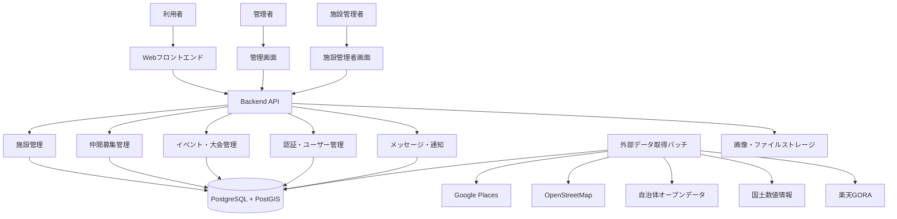

# Spotomo スポーツ・レジャー総合サイト仕様書 v1.0

作成日: 2026-06-25  
対象: スポーツ・レジャー仲間募集サービス / 施設検索サービス  
方針: **1つのサイトに集約し、1つのアカウント・1つの施設DB・1つの管理画面で運営する**

---

## 1. 目的

本仕様書は、ゴルフ、ランニング、アウトドア、球技、フィットネス、レジャーなどを個別サイトに分けず、**1つの総合サイトに集約して提供するための仕様**を定義する。

ユーザーは1つのアカウントで複数のスポーツ・レジャーの仲間募集に参加でき、施設情報・イベント情報・募集情報を横断的に検索できる。

---

## 2. 基本方針

### 2.1 サイト方針

| 項目 | 方針 |
|---|---|
| サイト | 1つの総合サイトに集約 |
| ユーザー管理 | 1つのアカウントで全カテゴリ利用可能 |
| 施設DB | 1つの共通施設DBで管理 |
| 仲間募集 | 全カテゴリ共通の募集機能を使用 |
| 管理画面 | 1つの管理画面で全カテゴリを管理 |
| 表示方法 | カテゴリ・種目別ページで表示を切り替える |
| 将来拡張 | 人気カテゴリはサブディレクトリまたはサブドメイン化可能 |

### 2.2 サイト名案

```text
Spotomo
スポーツ・レジャー仲間募集プラットフォーム
```

### 2.3 基本メッセージ

```text
ゴルフ、ランニング、アウトドア、球技、フィットネスなど、
さまざまなスポーツ・レジャーの仲間募集に1つのアカウントで参加できます。
```

---

## 3. 対象カテゴリ

### 3.1 大分類

| 大分類コード | 大分類名 | 内容 |
|---|---|---|
| golf | ゴルフ | ゴルフ場、練習場、ゴルフ仲間募集 |
| running | ランニング・マラソン | ランニング、マラソン、陸上競技、ランニングコース |
| outdoor | アウトドア | キャンプ、登山、BBQ、釣り、ハイキング |
| ball_sports | 球技 | サッカー、野球、テニス、バスケ、バレー等 |
| fitness | フィットネス | ジム、ヨガ、ピラティス、ダンス |
| martial_arts | 武道・格闘技 | 柔道、空手、剣道、ボクシング等 |
| water_sports | 水泳・水辺スポーツ | プール、SUP、カヤック、海水浴等 |
| winter_sports | ウィンタースポーツ | スキー、スノーボード等 |
| cycling | サイクリング | サイクリングコース、レンタサイクル等 |
| leisure | レジャー | ボウリング、カラオケ、ダーツ、ビリヤード等 |
| event | 大会・イベント | マラソン大会、スポーツイベント、体験会等 |

### 3.2 小分類例

| 大分類 | 小分類例 |
|---|---|
| ゴルフ | ゴルフ場、ゴルフ練習場、ショートコース、インドアゴルフ |
| ランニング | ランニングコース、陸上競技場、運動公園、マラソン大会 |
| アウトドア | キャンプ場、登山口、BBQ場、公園、釣り場、海水浴場 |
| 球技 | サッカー場、フットサル場、野球場、テニスコート、体育館 |
| フィットネス | ジム、ヨガスタジオ、ダンススタジオ、ピラティス |
| レジャー | ボウリング場、カラオケ、ダーツ、ビリヤード、ゲーム施設 |

---

## 4. サイト構成

### 4.1 URL構成

1つのサイト内でカテゴリ別ページを持つ。

```text
/
/golf
/running
/outdoor
/sports
/fitness
/leisure
/facilities
/facilities/{facility_id}
/recruitments
/recruitments/{recruitment_id}
/events
/events/{event_id}
/mypage
/admin
```

### 4.2 トップページ構成

トップページには以下を表示する。

```text
- サービス説明
- 種目から探す
- 地域から探す
- 現在地周辺から探す
- 施設から探す
- 仲間募集から探す
- 新着募集
- 人気カテゴリ
- おすすめ施設
- 開催予定イベント
```

### 4.3 カテゴリページ構成

例: `/golf`

```text
- ゴルフ仲間募集一覧
- ゴルフ場一覧
- ゴルフ練習場一覧
- 地域別ゴルフ施設
- 楽天GORA予約リンク
- 初心者向け募集
```

例: `/running`

```text
- ランニング仲間募集一覧
- マラソン大会一覧
- 陸上競技場一覧
- ランニングコース一覧
- 地域別ランニング施設
```

例: `/outdoor`

```text
- キャンプ仲間募集一覧
- 登山・ハイキング募集
- キャンプ場一覧
- BBQ場一覧
- 公園・自然施設一覧
```

---

## 5. システム全体構成

### 5.1 論理構成



### 5.2 物理構成案

| レイヤー | 技術候補 |
|---|---|
| フロントエンド | Next.js / Nuxt / React / Vue |
| バックエンドAPI | Node.js / NestJS / Go / Spring Boot |
| DB | PostgreSQL + PostGIS |
| キャッシュ | Redis |
| バッチ | Cron / Cloud Scheduler / GitHub Actions / ECS Scheduled Task |
| 画像保存 | S3互換ストレージ / Cloudflare R2 / AWS S3 |
| 検索 | PostgreSQL全文検索、将来 Elasticsearch / OpenSearch |
| 認証 | Supabase Auth / Cognito / 独自JWT / OAuth |
| インフラ | AWS / Vercel + Supabase / Docker構成 |

---

## 6. 主要機能

## 6.1 利用者向け機能

| 機能 | 内容 |
|---|---|
| 会員登録・ログイン | メール、Google、LINE、Apple等 |
| プロフィール | ニックネーム、性別任意、地域、興味カテゴリ、自己紹介 |
| 種目選択 | 興味のあるスポーツ・レジャーを複数選択 |
| 施設検索 | カテゴリ、地域、現在地、キーワードで検索 |
| 仲間募集検索 | 種目、日付、地域、レベル、性別条件等で検索 |
| 仲間募集作成 | 種目、施設、日時、人数、参加条件を設定 |
| 応募・参加 | 募集への参加申請、承認、キャンセル |
| メッセージ | 募集参加者間の連絡 |
| お気に入り | 施設、募集、イベントを保存 |
| 通報 | 不適切な募集・ユーザー・施設情報を通報 |

## 6.2 施設機能

| 機能 | 内容 |
|---|---|
| 施設一覧 | カテゴリ・地域別に施設表示 |
| 施設詳細 | 住所、地図、電話、URL、予約URL、設備、写真 |
| 施設カテゴリ | 複数カテゴリ・複数種目に対応 |
| 施設提案 | 利用者が未登録施設を提案 |
| 施設情報修正提案 | 利用者が誤情報を報告 |
| 施設管理者申請 | 施設オーナーが編集権限を申請 |

## 6.3 仲間募集機能

| 機能 | 内容 |
|---|---|
| 募集作成 | 種目、日時、場所、人数、参加条件、説明文 |
| 参加申請 | 申請制または即時参加制 |
| 募集管理 | 主催者が参加者を承認・拒否・キャンセル |
| 募集ステータス | 募集中、満員、終了、キャンセル、非公開 |
| 参加者一覧 | 主催者と参加者が確認可能 |
| レベル設定 | 初心者歓迎、中級者、経験者向け等 |

## 6.4 イベント・大会機能

| 機能 | 内容 |
|---|---|
| イベント一覧 | マラソン大会、スポーツイベント、体験会等 |
| イベント詳細 | 開催日、場所、公式URL、申込URL、カテゴリ |
| 外部イベント取込 | 自治体オープンデータ等から取得 |
| 手動登録 | 管理者がイベントを登録 |
| 募集連携 | イベント参加仲間募集を作成可能 |

## 6.5 管理画面機能

| 機能 | 内容 |
|---|---|
| ユーザー管理 | 会員検索、停止、通報確認 |
| 施設管理 | 施設登録、編集、公開、非公開、重複統合 |
| 施設承認 | 利用者提案・施設管理者申請の承認 |
| 募集管理 | 不適切募集の確認、削除、非公開 |
| イベント管理 | イベント登録、編集、公開 |
| カテゴリ管理 | 種目・カテゴリ・小分類の管理 |
| バッチ管理 | 取得履歴、エラー確認、再実行 |
| 外部データ確認 | Google、OSM、自治体データ等の取込確認 |
| 通報管理 | ユーザー通報、施設通報、募集通報の対応 |

---

## 7. データ取得方針

施設データは以下を組み合わせて取得する。

| データ元 | 用途 |
|---|---|
| Google Places API | 営業中施設、店舗系施設、電話番号、Webサイト、営業時間確認 |
| OpenStreetMap / Overpass API | 自然系POI、公園、登山口、キャンプ場、スポーツ施設 |
| 自治体オープンデータ | 公共施設、スポーツ施設、公園、公衆トイレ、駐車場、イベント |
| 国土数値情報 | 都市公園、自然公園区域、文化施設・スポーツ施設補完 |
| 楽天GORA API | ゴルフ場情報、予約導線 |
| 自社登録 | 予約URL、料金、利用ルール、閉鎖情報、写真、補足情報 |

### 7.1 取得方式

```text
外部データは基本的にバッチ取得する。
利用者画面では外部APIを直接叩かず、自社DBを検索する。
```

### 7.2 バッチ種別

| バッチ | 内容 | 頻度 |
|---|---|---|
| Google Places取得 | 施設候補・営業情報取得 | 週1回 |
| OSM取得 | 自然系・スポーツ施設POI取得 | 週1回〜月1回 |
| 自治体データ取得 | CSV/XLSX/JSON取得 | 週1回〜月1回 |
| 国土数値情報取得 | 公園・自然区域・スポーツ施設補完 | 月1回〜数か月に1回 |
| 楽天GORA取得 | ゴルフ場情報取得 | 週1回 |
| 重複判定 | 施設の統合候補抽出 | 毎日〜週1回 |
| 閉鎖・非公開確認 | 閉鎖施設や無効データ確認 | 月1回 |

---

## 8. 施設DB設計

施設DBは1つに集約する。
同じ施設が複数カテゴリに属するため、施設本体とカテゴリ・種目は別テーブルで管理する。

### 8.1 facilities

```sql
CREATE TABLE facilities (
  id BIGSERIAL PRIMARY KEY,
  name TEXT NOT NULL,
  normalized_name TEXT,
  address TEXT,
  prefecture TEXT,
  city TEXT,
  latitude DOUBLE PRECISION,
  longitude DOUBLE PRECISION,
  phone TEXT,
  website_url TEXT,
  reservation_url TEXT,
  description TEXT,
  status TEXT DEFAULT 'pending',
  verified BOOLEAN DEFAULT false,
  verified_at TIMESTAMP,
  last_checked_at TIMESTAMP,
  created_by BIGINT,
  updated_by BIGINT,
  created_at TIMESTAMP DEFAULT now(),
  updated_at TIMESTAMP DEFAULT now()
);
```

### 8.2 facility_categories

```sql
CREATE TABLE facility_categories (
  id BIGSERIAL PRIMARY KEY,
  facility_id BIGINT REFERENCES facilities(id),
  category_code TEXT NOT NULL,
  sub_category_code TEXT,
  created_at TIMESTAMP DEFAULT now()
);
```

### 8.3 facility_sports

```sql
CREATE TABLE facility_sports (
  id BIGSERIAL PRIMARY KEY,
  facility_id BIGINT REFERENCES facilities(id),
  sport_code TEXT NOT NULL,
  sport_name TEXT,
  created_at TIMESTAMP DEFAULT now()
);
```

### 8.4 facility_sources

```sql
CREATE TABLE facility_sources (
  id BIGSERIAL PRIMARY KEY,
  facility_id BIGINT REFERENCES facilities(id),
  source_type TEXT NOT NULL,
  source_id TEXT,
  source_url TEXT,
  license TEXT,
  raw_data JSONB,
  fetched_at TIMESTAMP DEFAULT now()
);
```

### 8.5 facility_details

共通設備情報を管理する。

```sql
CREATE TABLE facility_details (
  facility_id BIGINT PRIMARY KEY REFERENCES facilities(id),
  opening_hours TEXT,
  closed_days TEXT,
  business_period TEXT,
  price_info TEXT,
  has_parking BOOLEAN DEFAULT false,
  has_toilet BOOLEAN DEFAULT false,
  has_shower BOOLEAN DEFAULT false,
  has_locker BOOLEAN DEFAULT false,
  has_shop BOOLEAN DEFAULT false,
  has_rental BOOLEAN DEFAULT false,
  beginner_friendly BOOLEAN DEFAULT false,
  family_friendly BOOLEAN DEFAULT false,
  pet_allowed BOOLEAN DEFAULT false,
  notes TEXT,
  updated_at TIMESTAMP DEFAULT now()
);
```

### 8.6 種目別詳細テーブル

必要に応じて種目別詳細を持つ。

```text
facility_golf_details
facility_running_details
facility_outdoor_details
facility_ball_sports_details
facility_fitness_details
```

例: ゴルフ詳細

```sql
CREATE TABLE facility_golf_details (
  facility_id BIGINT PRIMARY KEY REFERENCES facilities(id),
  holes INTEGER,
  par INTEGER,
  course_count INTEGER,
  rakuten_gora_id TEXT,
  reservation_type TEXT,
  updated_at TIMESTAMP DEFAULT now()
);
```

例: ランニング詳細

```sql
CREATE TABLE facility_running_details (
  facility_id BIGINT PRIMARY KEY REFERENCES facilities(id),
  course_distance_km DOUBLE PRECISION,
  track_type TEXT,
  lap_distance_m INTEGER,
  locker_available BOOLEAN DEFAULT false,
  shower_available BOOLEAN DEFAULT false,
  updated_at TIMESTAMP DEFAULT now()
);
```

---

## 9. 仲間募集DB設計

### 9.1 recruitments

```sql
CREATE TABLE recruitments (
  id BIGSERIAL PRIMARY KEY,
  title TEXT NOT NULL,
  description TEXT,
  sport_code TEXT NOT NULL,
  category_code TEXT,
  facility_id BIGINT REFERENCES facilities(id),
  organizer_user_id BIGINT NOT NULL,
  event_date DATE,
  start_time TIME,
  end_time TIME,
  prefecture TEXT,
  city TEXT,
  meeting_place TEXT,
  max_participants INTEGER,
  current_participants INTEGER DEFAULT 0,
  level TEXT,
  gender_condition TEXT,
  age_condition TEXT,
  participation_fee TEXT,
  status TEXT DEFAULT 'open',
  visibility TEXT DEFAULT 'public',
  created_at TIMESTAMP DEFAULT now(),
  updated_at TIMESTAMP DEFAULT now()
);
```

### 9.2 recruitment_participants

```sql
CREATE TABLE recruitment_participants (
  id BIGSERIAL PRIMARY KEY,
  recruitment_id BIGINT REFERENCES recruitments(id),
  user_id BIGINT NOT NULL,
  status TEXT DEFAULT 'pending',
  message TEXT,
  applied_at TIMESTAMP DEFAULT now(),
  approved_at TIMESTAMP,
  canceled_at TIMESTAMP
);
```

---

## 10. ユーザー・権限設計

### 10.1 ユーザー種別

| ロール | 内容 |
|---|---|
| guest | 未ログインユーザー。閲覧のみ |
| user | 一般利用者。募集作成・参加可能 |
| organizer | 募集主催者。userと同一でもよい |
| facility_owner | 施設管理者。自施設の編集申請・管理が可能 |
| moderator | 通報対応・承認作業担当 |
| admin | 全体管理者 |

### 10.2 権限概要

| 操作 | guest | user | facility_owner | moderator | admin |
|---|---:|---:|---:|---:|---:|
| 施設閲覧 | ○ | ○ | ○ | ○ | ○ |
| 募集閲覧 | ○ | ○ | ○ | ○ | ○ |
| 募集作成 | × | ○ | ○ | ○ | ○ |
| 参加申請 | × | ○ | ○ | ○ | ○ |
| 施設提案 | × | ○ | ○ | ○ | ○ |
| 施設編集申請 | × | ○ | ○ | ○ | ○ |
| 施設直接編集 | × | × | 自施設のみ | ○ | ○ |
| 承認・非公開 | × | × | × | ○ | ○ |
| ユーザー停止 | × | × | × | × | ○ |

---

## 11. 手動登録・承認フロー

### 11.1 管理者による施設登録

```text
管理者が施設を登録
↓
住所から緯度経度を取得
↓
既存施設と重複チェック
↓
カテゴリ・種目を設定
↓
公式URL・予約URL・料金・設備を登録
↓
写真・注意事項を追加
↓
公開状態を active に変更
↓
施設検索に表示
```

### 11.2 利用者による施設提案

```text
利用者が施設を提案
↓
status = pending で仮登録
↓
管理者が内容確認
↓
重複施設を確認
↓
問題なければ承認
↓
status = active で公開
```

### 11.3 施設管理者申請

```text
施設管理者が自施設を申請
↓
会社名・担当者・連絡先・証明情報を入力
↓
運営者が確認
↓
承認後、facility_owner 権限を付与
↓
施設情報の編集が可能になる
```

---

## 12. 重複判定仕様

外部APIや手動登録により同一施設が複数回登録される可能性があるため、重複判定を行う。

### 12.1 判定条件

```text
- 施設名が類似している
- 緯度経度が100m以内
- 住所が近い
- 電話番号が同じ
- 公式URLが同じ
- 外部source_idが同じ
```

### 12.2 名称正規化例

```text
○○キャンプ場
○○オートキャンプ場
○○ Camp Site
○○ Camping Ground

→ 同一候補として判定
```

### 12.3 PostGIS距離判定例

```sql
SELECT id, name
FROM facilities
WHERE ST_DWithin(
  geography(ST_MakePoint(longitude, latitude)),
  geography(ST_MakePoint(:lng, :lat)),
  100
);
```

---

## 13. 検索仕様

### 13.1 施設検索

検索条件:

```text
- キーワード
- カテゴリ
- 種目
- 都道府県
- 市区町村
- 現在地からの距離
- 設備条件
- 予約URLあり
- 駐車場あり
- トイレあり
- 初心者向け
```

API例:

```http
GET /api/facilities?category=outdoor&sport=camp&prefecture=tokyo
GET /api/facilities?lat=35.6812&lng=139.7671&radius=10000
GET /api/facilities?q=テニス&city=渋谷区
```

### 13.2 仲間募集検索

検索条件:

```text
- キーワード
- 種目
- カテゴリ
- 日付
- 地域
- 施設
- レベル
- 募集状態
- 参加費
```

API例:

```http
GET /api/recruitments?sport=golf&prefecture=tokyo
GET /api/recruitments?sport=running&date_from=2026-07-01
GET /api/recruitments?facility_id=123
```

---

## 14. API設計

### 14.1 施設API

| Method | Path | 内容 |
|---|---|---|
| GET | /api/facilities | 施設一覧検索 |
| GET | /api/facilities/{id} | 施設詳細取得 |
| POST | /api/facilities/proposals | 施設提案 |
| POST | /api/admin/facilities | 管理者施設登録 |
| PUT | /api/admin/facilities/{id} | 管理者施設更新 |
| POST | /api/admin/facilities/{id}/approve | 施設承認 |
| POST | /api/admin/facilities/{id}/merge | 重複施設統合 |

### 14.2 仲間募集API

| Method | Path | 内容 |
|---|---|---|
| GET | /api/recruitments | 募集一覧検索 |
| GET | /api/recruitments/{id} | 募集詳細 |
| POST | /api/recruitments | 募集作成 |
| PUT | /api/recruitments/{id} | 募集更新 |
| POST | /api/recruitments/{id}/apply | 参加申請 |
| POST | /api/recruitments/{id}/approve | 参加承認 |
| POST | /api/recruitments/{id}/cancel | 募集キャンセル |

### 14.3 カテゴリAPI

| Method | Path | 内容 |
|---|---|---|
| GET | /api/categories | カテゴリ一覧 |
| GET | /api/sports | 種目一覧 |
| GET | /api/areas | 地域一覧 |

### 14.4 管理API

| Method | Path | 内容 |
|---|---|---|
| GET | /api/admin/dashboard | 管理ダッシュボード |
| GET | /api/admin/facility-proposals | 施設提案一覧 |
| GET | /api/admin/reports | 通報一覧 |
| GET | /api/admin/batch-runs | バッチ実行履歴 |
| POST | /api/admin/batches/{job}/run | バッチ手動実行 |

---

## 15. 管理画面仕様

### 15.1 メニュー構成

```text
管理ダッシュボード
ユーザー管理
施設管理
施設提案承認
重複施設確認
仲間募集管理
イベント管理
カテゴリ管理
通報管理
外部データ取込履歴
バッチ管理
システム設定
```

### 15.2 施設管理画面

表示項目:

```text
- 施設ID
- 施設名
- カテゴリ
- 種目
- 住所
- 取得元
- 公開状態
- 確認状態
- 最終確認日
- 重複候補有無
```

操作:

```text
- 新規登録
- 編集
- 公開
- 非公開
- 閉鎖
- 重複統合
- 外部データ確認
- 写真追加
- 施設管理者紐づけ
```

---

## 16. ステータス設計

### 16.1 施設ステータス

| status | 意味 |
|---|---|
| pending | 申請中・確認待ち |
| active | 公開中 |
| draft | 下書き |
| hidden | 非表示 |
| rejected | 却下 |
| closed | 閉鎖 |
| duplicate | 重複 |

### 16.2 募集ステータス

| status | 意味 |
|---|---|
| open | 募集中 |
| full | 満員 |
| closed | 募集終了 |
| canceled | キャンセル |
| hidden | 非表示 |
| reported | 通報あり |

### 16.3 参加ステータス

| status | 意味 |
|---|---|
| pending | 申請中 |
| approved | 承認済み |
| rejected | 拒否 |
| canceled | キャンセル |
| attended | 参加済み |
| no_show | 無断欠席 |

---

## 17. 通知仕様

通知対象:

```text
- 参加申請が来たとき
- 参加申請が承認されたとき
- 募集がキャンセルされたとき
- メッセージを受信したとき
- 施設提案が承認されたとき
- 通報対応が必要なとき
```

通知手段:

```text
- アプリ内通知
- メール通知
- 将来: LINE通知 / Push通知
```

---

## 18. セキュリティ・運用

### 18.1 セキュリティ

```text
- HTTPS必須
- パスワードはハッシュ化
- OAuthログイン対応
- 管理画面は管理者権限必須
- APIは認証・認可チェック必須
- 通報・ブロック機能を実装
- 画像アップロードは拡張子・サイズ・MIMEを検証
- 外部APIキーは環境変数またはSecret Managerで管理
```

### 18.2 監視

```text
- APIエラー監視
- バッチ失敗監視
- DB容量監視
- 外部API利用量監視
- 通報件数監視
- 不正ユーザー監視
```

---

## 19. MVP実装範囲

### Phase 1: 最小構成

```text
- 1つの総合サイト
- 会員登録・ログイン
- カテゴリ一覧
- 施設DB
- 施設検索
- 仲間募集作成
- 仲間募集参加申請
- 管理者による施設手動登録
- 管理画面の基本機能
```

### Phase 2: 外部データ取込

```text
- Google Places API取込
- OpenStreetMap取込
- 自治体オープンデータ取込
- 楽天GORA取込
- 重複判定
- 施設承認フロー
```

### Phase 3: 参加型機能

```text
- 利用者による施設提案
- 施設情報修正提案
- 施設管理者申請
- メッセージ機能
- 通報機能
- お気に入り機能
```

### Phase 4: 拡張

```text
- イベント・大会情報
- レビュー
- 写真投稿
- LINE通知
- サブカテゴリ別SEOページ
- 人気カテゴリのLP作成
```

---

## 20. 画面一覧

| 画面 | URL | 内容 |
|---|---|---|
| トップ | / | サービス紹介、カテゴリ導線 |
| ゴルフ | /golf | ゴルフ募集・施設 |
| ランニング | /running | ランニング募集・施設・大会 |
| アウトドア | /outdoor | キャンプ・登山・BBQ等 |
| スポーツ | /sports | 球技・体育館系 |
| フィットネス | /fitness | ジム・ヨガ等 |
| レジャー | /leisure | ボウリング・カラオケ等 |
| 施設一覧 | /facilities | 全施設検索 |
| 施設詳細 | /facilities/{id} | 施設詳細 |
| 募集一覧 | /recruitments | 仲間募集検索 |
| 募集詳細 | /recruitments/{id} | 募集詳細 |
| 募集作成 | /recruitments/new | 募集作成 |
| マイページ | /mypage | 参加・作成募集管理 |
| 管理画面 | /admin | 管理者用 |

---

## 21. 将来拡張方針

初期は1つのサイトに集約する。
将来的にアクセスが多いカテゴリは、同一DB・同一ユーザー管理のまま、URLやLPを強化する。

```text
初期:
spotomo.jp/golf
spotomo.jp/running
spotomo.jp/outdoor

将来候補:
golf.spotomo.jp
run.spotomo.jp
outdoor.spotomo.jp
```

ただし、以下は分離しない。

```text
- ユーザーDB
- 施設DB
- 仲間募集DB
- 管理画面
- 認証基盤
```

---

## 22. 結論

本サービスは、初期段階では複数サイトに分けず、**1つの総合スポーツ・レジャー仲間募集サイト**として構築する。

推奨構成は以下である。

```text
サイト: 1つ
DB: 1つ
ユーザー管理: 1つ
施設管理: 1つ
管理画面: 1つ
画面表示: カテゴリ・種目別に分ける
```

この構成により、開発コストを抑えながら、施設データ・ユーザー・仲間募集を一元管理できる。
また、将来的に人気カテゴリだけを独立LPやサブドメインとして展開することも可能である。
