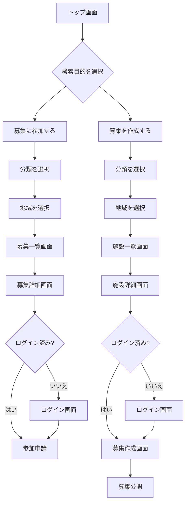

# Spotomo トップ画面設計書 v1.0

作成日: 2026-06-25  
更新日: 2026-06-25  
対象サイト: Spotomo / スポーツ・レジャー仲間募集プラットフォーム  
対象画面: トップ画面 / ホーム画面  
前提仕様: 1つのサイトに集約、1つの共通施設DB、1つのユーザー管理、1つの管理画面  
更新内容: トップ画面検索の目的を「募集参加」と「募集作成」の2目的に明確化し、検索条件を「分類 + 地域」中心に再設計

---

## 1. 目的

トップ画面は、スポーツ・レジャー仲間募集サイトの入口として、利用者が以下の2つの主要行動をすぐ開始できることを目的とする。

1. **募集に参加する**
   - 参加できる仲間募集を探す。
   - 検索対象は募集データ `recruitments` とする。

2. **募集を作成する**
   - 募集の開催場所として使う施設を探す。
   - 検索対象は施設データ `facilities` とする。

本サイトは、単なる施設検索サイトではなく、**スポーツ・レジャーの仲間募集を中心に、募集参加と募集作成を支援するサービス**である。

トップ画面では、ユーザーが最初に迷わないように、検索目的を明確に分ける。

```text
募集に参加したい人 → 募集データを検索 → 募集一覧へ
募集を作成したい人 → 施設データを検索 → 施設一覧から募集作成へ
```

---

## 2. 基本方針

```text
サイト: 1つ
ユーザー管理: 1つ
施設DB: 1つ
仲間募集: 1つの共通機能
検索目的: 募集参加 / 募集作成 の2つ
検索条件: 分類 + 地域 を基本とする
表示: カテゴリ・種目別に切り替え
管理画面: 1つ
```

トップ画面では、以下の2つを最重要導線とする。

| 導線 | 目的 | 検索対象 | 遷移先 |
|---|---|---|---|
| 募集を探す | 既存の仲間募集に参加する | 募集データ | 募集一覧画面 |
| 募集を作成する | 開催場所となる施設を探して募集を作る | 施設データ | 施設一覧 → 募集作成画面 |

補助導線として、以下も配置する。

| 補助導線 | 目的 |
|---|---|
| 種目から探す | ゴルフ、ランニング、アウトドアなど種目別ページへ誘導 |
| 施設を見る | 施設検索・施設詳細を閲覧 |
| イベント・大会を見る | 大会・イベント情報へ誘導 |
| マイページ | 自分の参加予定・作成募集・保存施設を確認 |

---

## 3. 想定ユーザー

| ユーザー種別 | 主な目的 | トップ画面での主導線 |
|---|---|---|
| 一般利用者 | 一緒にスポーツ・レジャーへ参加する仲間を探す | 募集を探す |
| 募集投稿者 | ゴルフ、ランニング、キャンプ等の仲間募集を作成する | 募集を作成する |
| 施設利用者 | 募集作成前に利用できる施設を探す | 募集を作成する / 施設を見る |
| 施設管理者 | 施設情報を登録・修正したい | 施設管理者向け導線 |
| イベント主催者 | 大会・イベント情報を登録・告知したい | イベント登録導線 |
| 管理者 | 投稿、施設、ユーザー、カテゴリを管理する | 管理画面 |

---

## 4. トップ画面の役割

トップ画面は、以下の情報を優先して表示する。

1. サービスの価値を短く伝える
2. 検索目的を2つに分けて表示する
3. 分類 + 地域で検索できるようにする
4. 主要カテゴリを見せる
5. 新着の仲間募集を見せる
6. おすすめ施設を見せる
7. イベント・大会情報を見せる
8. 利用開始ボタンを見せる

トップ画面の検索は、詳細検索ではなく、**目的別の入口検索**として位置づける。詳細な絞り込みは、募集一覧画面または施設一覧画面で行う。

---

## 5. メインコピー案

### メインコピー

```text
スポーツ・レジャーの仲間を見つけよう
```

### サブコピー

```text
ゴルフ、ランニング、アウトドア、球技、フィットネスなど、さまざまな活動の仲間募集を探したり、施設を選んで募集を作成できます。
```

### CTA文言

| ボタン | 目的 | 遷移先 |
|---|---|---|
| 募集を探す | 参加できる募集を探す | `/search/recruitments` |
| 募集を作成する | 施設を選んで募集を作る | `/search/facilities?purpose=create_recruitment` |
| 種目から探す | 種目別ページへ移動 | `/categories` |

---

## 6. 画面構成

トップ画面は以下の順番で構成する。

```text
1. ヘッダー
2. ヒーローエリア
3. 目的別検索エリア
   - 募集を探す
   - 募集を作成する
4. カテゴリ一覧
5. 新着仲間募集
6. おすすめ施設
7. イベント・大会情報
8. サービスの特徴
9. 利用の流れ
10. フッター
```

---

## 7. ワイヤーフレーム

### 7.1 PC版

```text
+----------------------------------------------------------+
| Logo   種目から探す  募集を探す  施設  イベント  ログイン  |
+----------------------------------------------------------+
|                                                          |
|  スポーツ・レジャーの仲間を見つけよう                      |
|  募集を探す、または施設を選んで募集を作成できます           |
|                                                          |
|  [募集を探す] [募集を作成する]                              |
|                                                          |
+----------------------------------------------------------+
|  目的別検索                                               |
|  [募集に参加する] [募集を作成する]                          |
|                                                          |
|  分類 [ゴルフ v]  地域 [東京都 v]  [検索する]               |
|                                                          |
|  ※ 募集に参加する: 募集一覧へ                              |
|  ※ 募集を作成する: 施設一覧へ                              |
+----------------------------------------------------------+
|  種目から探す                                             |
|  [ゴルフ] [ランニング] [アウトドア] [球技] [フィットネス]    |
|  [水泳] [ウィンター] [レジャー] [すべて]                   |
+----------------------------------------------------------+
|  新着の仲間募集                                           |
|  [募集カード] [募集カード] [募集カード]                    |
+----------------------------------------------------------+
|  おすすめ施設                                             |
|  [施設カード] [施設カード] [施設カード]                    |
+----------------------------------------------------------+
|  イベント・大会情報                                       |
|  [イベントカード] [イベントカード] [イベントカード]          |
+----------------------------------------------------------+
|  Spotomoでできること                                      |
|  1. 募集を探す  2. 施設を選んで募集作成  3. 参加管理        |
+----------------------------------------------------------+
|  Footer                                                   |
+----------------------------------------------------------+
```

### 7.2 スマートフォン版

```text
+------------------------------+
| Logo                  Menu   |
+------------------------------+
| スポーツ・レジャーの仲間を     |
| 見つけよう                    |
|                              |
| [募集を探す]                  |
| [募集を作成する]              |
+------------------------------+
| 目的を選択                    |
| ○ 募集に参加する              |
| ○ 募集を作成する              |
|                              |
| 分類                          |
| [ゴルフ v]                    |
| 地域                          |
| [東京都 v]                    |
| [検索する]                    |
+------------------------------+
| 種目から探す                  |
| [ゴルフ] [ランニング]          |
| [アウトドア] [球技]            |
| [フィットネス] [レジャー]      |
+------------------------------+
| 新着の仲間募集                |
| [募集カード]                  |
| [募集カード]                  |
+------------------------------+
| おすすめ施設                  |
| [施設カード]                  |
+------------------------------+
| イベント・大会情報            |
| [イベントカード]              |
+------------------------------+
```

---

## 8. ヘッダー仕様

### 表示項目

| 項目 | 内容 |
|---|---|
| ロゴ | Spotomoロゴ |
| 種目から探す | カテゴリ一覧へ遷移 |
| 募集を探す | 募集検索画面へ遷移 |
| 募集を作成する | 施設検索または募集作成導線へ遷移 |
| 施設 | 施設検索へ遷移 |
| イベント | イベント・大会一覧へ遷移 |
| ログイン | ログイン画面へ遷移 |
| 会員登録 | 新規登録画面へ遷移 |

### ログイン後表示

| 項目 | 内容 |
|---|---|
| マイページ | 自分の募集・参加履歴 |
| 募集作成 | 施設選択後に募集作成 |
| 通知 | 参加申請・メッセージ通知 |
| プロフィール | ユーザー情報編集 |
| ログアウト | セッション終了 |

---

## 9. ヒーローエリア仕様

### 目的

初回訪問者に対して、サービスの利用目的をすぐ理解させる。

### 表示内容

| 項目 | 内容 |
|---|---|
| メインコピー | スポーツ・レジャーの仲間を見つけよう |
| サブコピー | 募集を探す、または施設を選んで募集を作成できることを説明 |
| メインCTA | 募集を探す |
| サブCTA | 募集を作成する |
| 背景画像 | 複数スポーツ・レジャーの参加イメージ |

### 背景画像方針

- 明るい印象
- 緑・自然・スポーツ感を重視
- 1種目だけに偏らない
- ゴルフ、ランニング、アウトドア、球技など複数ジャンルを連想できる
- 人物は楽しそうに参加しているイメージ
- スマホ表示では文字の可読性を優先

---

## 10. 目的別検索エリア仕様

### 10.1 目的

トップ画面検索は、以下の2目的に分ける。

| 検索目的 | ユーザー意図 | 検索対象 | 検索結果 |
|---|---|---|---|
| 募集に参加する | 参加できる仲間募集を探したい | `recruitments` | 募集一覧 |
| 募集を作成する | 開催場所となる施設を探したい | `facilities` | 施設一覧 |

トップ画面検索は、**募集データ検索**と**施設データ検索**を混在させない。ユーザーが最初に目的を選び、同じ「分類 + 地域」条件でも検索対象を切り替える。

---

### 10.2 検索フォーム項目

| 項目 | 内容 | 必須 | MVP |
|---|---|---:|---:|
| 検索目的 | 募集に参加する / 募集を作成する | 必須 | 必須 |
| 分類 | ゴルフ、ランニング、アウトドア等 | 必須 | 必須 |
| 地域 | 都道府県、市区町村、駅名、エリア | 任意 | 必須寄り |
| キーワード | 募集タイトル、施設名等 | 任意 | 後続 |
| 日付 | 開催日、週末、今月等 | 任意 | 後続 |

MVPでは、以下3項目を優先する。

```text
検索目的
分類
地域
```

---

### 10.3 検索目的のUI

タブ形式を基本とする。

```text
[ 募集に参加する ] [ 募集を作成する ]
```

#### タブ1: 募集に参加する

説明文:

```text
参加できる仲間募集を分類と地域から探します。
```

検索後:

```text
募集一覧画面へ遷移
```

#### タブ2: 募集を作成する

説明文:

```text
募集を開催する施設を分類と地域から探します。
```

検索後:

```text
施設一覧画面へ遷移し、施設選択後に募集作成へ進む
```

---

### 10.4 検索条件: 分類

分類は、スポーツ・レジャーの大分類または種目を指定する。

| 分類 | 例 |
|---|---|
| ゴルフ | ゴルフ場、ゴルフ練習場、ゴルフ仲間募集 |
| ランニング・マラソン | ランニング、マラソン大会、陸上競技場 |
| アウトドア | キャンプ、登山、BBQ、釣り |
| 球技 | サッカー、フットサル、野球、テニス、バスケ |
| フィットネス | ジム、ヨガ、ダンス |
| 水泳・水辺 | プール、SUP、カヤック |
| ウィンター | スキー、スノーボード |
| レジャー | ボウリング、ダーツ、カラオケ等 |

---

### 10.5 検索条件: 地域

地域は、募集の開催地域または施設所在地を指定する。

| 地域種別 | 例 |
|---|---|
| 都道府県 | 東京都、神奈川県、千葉県、大阪府 |
| 市区町村 | 新宿区、横浜市、さいたま市 |
| 駅名 | 新宿、渋谷、大宮、横浜 |
| エリア名 | 奥多摩、湘南、箱根、富士五湖 |

トップ画面では「現在地周辺」を主機能にしない。現在地は補助機能として扱い、基本はユーザーが分類と地域を選ぶ設計とする。

---

### 10.6 募集に参加する検索

#### 入力例

```text
目的: 募集に参加する
分類: ゴルフ
地域: 千葉県
```

#### 検索結果

```text
千葉県のゴルフ仲間募集一覧
```

#### 遷移

```text
トップ画面
↓
募集に参加する
↓
分類・地域を選択
↓
募集一覧画面
↓
募集詳細画面
↓
参加申請
```

#### API

```http
GET /api/recruitments?category=golf&area=chiba
```

---

### 10.7 募集を作成する検索

#### 入力例

```text
目的: 募集を作成する
分類: キャンプ
地域: 山梨県
```

#### 検索結果

```text
山梨県のキャンプ場一覧
```

#### 遷移

```text
トップ画面
↓
募集を作成する
↓
分類・地域を選択
↓
施設一覧画面
↓
施設詳細画面
↓
この施設で募集を作成
↓
募集作成画面
↓
募集公開
```

#### API

```http
GET /api/facilities?category=camp&area=yamanashi&purpose=create_recruitment
```

---

### 10.8 検索ボタン文言

| 検索目的 | ボタン文言 |
|---|---|
| 募集に参加する | 募集を検索する |
| 募集を作成する | 施設を検索する |

---

### 10.9 空結果時の導線

#### 募集検索で0件の場合

表示文:

```text
該当する募集はまだありません。条件を変更するか、この地域で募集を作成できます。
```

導線:

```text
[条件を変更する]
[この条件で募集を作成する]
```

#### 施設検索で0件の場合

表示文:

```text
該当する施設が見つかりません。施設を手動登録して募集を作成できます。
```

導線:

```text
[条件を変更する]
[施設を登録する]
```

---

## 11. カテゴリ一覧仕様

### 表示カテゴリ

| カテゴリ | URL | 表示例 |
|---|---|---|
| ゴルフ | `/golf` | ゴルフ仲間、ゴルフ場、練習場 |
| ランニング | `/running` | ランニング仲間、マラソン大会、競技場 |
| アウトドア | `/outdoor` | キャンプ、登山、BBQ、釣り |
| 球技 | `/ball-sports` | サッカー、野球、テニス、バスケ |
| フィットネス | `/fitness` | ジム、ヨガ、ダンス |
| 水泳・水辺 | `/water-sports` | プール、SUP、カヤック |
| ウィンター | `/winter-sports` | スキー、スノーボード |
| レジャー | `/leisure` | ボウリング、ダーツ、カラオケ |
| すべて | `/categories` | 全カテゴリ一覧 |

### カード表示項目

| 項目 | 内容 |
|---|---|
| アイコン | カテゴリを表すアイコン |
| カテゴリ名 | ゴルフ、ランニング等 |
| 説明文 | 何を探せるか短く表示 |
| 募集件数 | 参加可能な募集数 |
| 施設件数 | 募集作成に使える施設数 |

---

## 12. 新着仲間募集セクション

### 目的

利用者が現在募集されている活動をすぐ確認できるようにする。

### 表示件数

PC: 6件  
スマホ: 3件

### 募集カード項目

| 項目 | 内容 |
|---|---|
| タイトル | 募集タイトル |
| カテゴリ | ゴルフ、ランニング等 |
| 開催日 | 活動予定日 |
| 地域 | 都道府県、市区町村 |
| 施設名 | 紐づく施設がある場合に表示 |
| 募集人数 | 例: 2/4人 |
| 投稿者 | ニックネーム、アイコン |
| ステータス | 募集中、満員、終了 |

### API

```http
GET /api/recruitments?sort=new&limit=6
```

---

## 13. おすすめ施設セクション

### 目的

募集作成時に利用できる施設候補をトップ画面で見せる。

### 表示対象

- 人気施設
- 新着登録施設
- 管理者確認済み施設
- 募集作成でよく使われる施設
- 選択地域に関連する施設

### 施設カード項目

| 項目 | 内容 |
|---|---|
| 施設名 | 施設名称 |
| カテゴリ | ゴルフ場、キャンプ場、体育館等 |
| 地域 | 都道府県、市区町村 |
| 写真 | 登録画像またはデフォルト画像 |
| 対応種目 | ゴルフ、ランニング、BBQ等 |
| 予約URL | 予約可能な場合に表示 |
| 確認済み | 管理者確認済みの場合に表示 |
| CTA | この施設で募集を作成 |

### API

```http
GET /api/facilities/recommended?limit=6
```

---

## 14. イベント・大会情報セクション

### 目的

マラソン大会、ゴルフコンペ、アウトドアイベント、地域スポーツイベント等への導線を作る。

### 表示項目

| 項目 | 内容 |
|---|---|
| イベント名 | 大会・イベント名称 |
| カテゴリ | ランニング、ゴルフ、アウトドア等 |
| 開催日 | 日付 |
| 開催地域 | 都道府県、市区町村 |
| 会場施設 | 紐づく施設がある場合に表示 |
| 申込URL | 外部公式サイトがある場合に表示 |

### API

```http
GET /api/events?sort=upcoming&limit=6
```

---

## 15. サービス特徴セクション

### 表示内容

| 特徴 | 説明 |
|---|---|
| 募集を探せる | 分類と地域から参加できる仲間募集を探せる |
| 施設を選んで募集できる | 施設DBから場所を選び、その施設で募集を作成できる |
| 1つのサイトで探せる | 複数ジャンルのスポーツ・レジャーを横断利用できる |
| 施設と募集を紐づけ | 募集場所となる施設情報を一緒に確認できる |
| カテゴリ別に探しやすい | ゴルフ、ランニング、アウトドアなど種目別に整理 |
| 手動確認で情報補完 | 予約URL、料金、利用ルールなどを運営側で補完 |

---

## 16. 利用の流れセクション

### 16.1 募集に参加する場合

```text
1. トップ画面で「募集に参加する」を選択
2. 分類を選ぶ
3. 地域を選ぶ
4. 募集一覧を確認する
5. 募集詳細を見る
6. 参加申請する
7. メッセージで調整する
8. 当日参加する
```

### 16.2 募集を作成する場合

```text
1. トップ画面で「募集を作成する」を選択
2. 分類を選ぶ
3. 地域を選ぶ
4. 施設一覧を確認する
5. 施設を選択する
6. 募集内容を入力する
7. 募集を公開する
8. 参加申請を確認する
```

---

## 17. フッター仕様

### 表示項目

| グループ | 項目 |
|---|---|
| サービス | Spotomoとは、使い方、よくある質問 |
| 探す | 募集を探す、施設、イベント、カテゴリ一覧 |
| 登録 | 募集を作成する、施設を登録する、イベントを登録する |
| 法務 | 利用規約、プライバシーポリシー、特定商取引法表示 |
| 運営 | お問い合わせ、会社情報 |

---

## 18. 画面遷移

### 18.1 全体遷移

```text
トップ
 ├─ /categories
 ├─ /golf
 ├─ /running
 ├─ /outdoor
 ├─ /search/recruitments
 │   └─ /recruitments/{id}
 │       └─ /recruitments/{id}/apply
 ├─ /search/facilities
 │   └─ /facilities/{id}
 │       └─ /recruitments/new?facility_id={id}
 ├─ /events
 │   └─ /events/{id}
 ├─ /login
 ├─ /signup
 └─ /mypage
```

### 18.2 画面遷移図



---

## 19. 表示データ取得仕様

### 初期表示時に取得するデータ

| データ | API |
|---|---|
| カテゴリ一覧 | `GET /api/categories` |
| 地域一覧 | `GET /api/areas` |
| 新着仲間募集 | `GET /api/recruitments?sort=new&limit=6` |
| おすすめ施設 | `GET /api/facilities/recommended?limit=6` |
| 直近イベント | `GET /api/events?sort=upcoming&limit=6` |
| 統計情報 | `GET /api/stats/home` |

### 目的別検索API

#### 募集に参加する

```http
GET /api/recruitments?category={category}&area={area}
```

#### 募集を作成する

```http
GET /api/facilities?category={category}&area={area}&purpose=create_recruitment
```

### 統計情報例

```json
{
  "recruitment_count": 1200,
  "facility_count": 35000,
  "event_count": 420,
  "category_count": 40
}
```

---

## 20. コンポーネント構成

```text
components/home/
  HeroSection.vue
  PurposeSearchBox.vue
  SearchPurposeTabs.vue
  CategorySelector.vue
  AreaSelector.vue
  CategoryGrid.vue
  RecruitmentCardList.vue
  FacilityCardList.vue
  EventCardList.vue
  FeatureSection.vue
  UsageFlowSection.vue

components/common/
  Header.vue
  Footer.vue
  CategoryCard.vue
  RecruitmentCard.vue
  FacilityCard.vue
  EventCard.vue
  PrimaryButton.vue
```

---

## 21. レスポンシブ対応

### PC

- 最大幅: 1200px
- カードは3列または4列
- ヒーロー画像を横長表示
- ヘッダーメニューを常時表示
- 目的別検索は横並びタブ + 横並びフォーム

### タブレット

- カードは2列
- 検索フォームは2段構成
- ヒーロー画像は簡略化

### スマートフォン

- カードは1列
- CTAボタンは縦並び
- ヘッダーはハンバーガーメニュー
- 目的選択、分類、地域、検索ボタンは縦並び
- 重要CTAを画面上部に配置

---

## 22. SEO設計

### title

```text
Spotomo | スポーツ・レジャーの仲間募集・施設検索サイト
```

### meta description

```text
ゴルフ、ランニング、アウトドア、球技、フィットネスなど、スポーツ・レジャーの仲間募集を分類と地域から探せます。施設を選んで募集を作成することもできます。
```

### h1

```text
スポーツ・レジャーの仲間を見つけよう
```

### 構造化データ候補

- WebSite
- Organization
- BreadcrumbList
- Event
- SportsActivityLocation
- LocalBusiness

---

## 23. アクセシビリティ

- ボタンには明確なラベルを設定する
- 目的選択タブはキーボード操作可能にする
- ラジオボタンまたはタブに `aria-selected` を設定する
- 画像にはaltテキストを設定する
- 色だけで状態を判別させない
- キーボード操作で検索・カテゴリ選択ができる
- 文字サイズはスマホで読みやすいサイズにする
- 背景画像上の文字はコントラストを確保する

---

## 24. パフォーマンス要件

| 項目 | 目標 |
|---|---|
| 初期表示 | 3秒以内 |
| LCP | 2.5秒以内を目標 |
| 画像 | WebP / AVIFを優先 |
| API | トップ表示用APIは必要最小限 |
| キャッシュ | カテゴリ、地域、統計、施設おすすめはキャッシュ可 |

### キャッシュ方針

| データ | キャッシュ |
|---|---|
| カテゴリ一覧 | 長時間キャッシュ可 |
| 地域一覧 | 長時間キャッシュ可 |
| 新着仲間募集 | 1〜5分 |
| おすすめ施設 | 10〜60分 |
| イベント情報 | 10〜60分 |
| 統計情報 | 1時間 |

---

## 25. 管理画面連携

トップ画面に表示する内容は、管理画面で一部制御できるようにする。

| 管理項目 | 内容 |
|---|---|
| ヒーロー画像 | 管理者が差し替え可能 |
| メインコピー | 管理者が編集可能 |
| 検索目的タブ文言 | 管理者が編集可能 |
| 表示カテゴリ | 表示・非表示、並び順を変更可能 |
| 表示地域 | 表示・非表示、並び順を変更可能 |
| おすすめ施設 | 自動または手動選定 |
| おすすめ募集 | 自動または手動選定 |
| イベント掲載 | 表示・非表示を管理 |
| お知らせ | トップ画面に掲載可能 |

---

## 26. MVP実装範囲

### MVPで必須

```text
ヘッダー
ヒーローエリア
目的別検索エリア
  - 募集に参加する
  - 募集を作成する
分類選択
地域選択
カテゴリ一覧
新着仲間募集
おすすめ施設
フッター
```

### MVP後に追加

```text
キーワード検索
日付検索
イベント・大会情報
ランキング
おすすめユーザー
現在地補助検索
地図表示
施設管理者向け導線
特集ページ
```

---

## 27. 非機能要件

| 項目 | 方針 |
|---|---|
| 可用性 | トップ画面は障害時も静的表示できる構成を検討 |
| 保守性 | セクション単位でコンポーネント化 |
| 拡張性 | カテゴリ追加に強い設計 |
| セキュリティ | ログイン状態に応じたCTA制御 |
| 運用性 | 表示内容を管理画面から変更可能にする |

---

## 28. 今後の検討事項

1. トップ画面の正式キャッチコピー
2. ヒーロー画像のデザイン方針
3. カテゴリ一覧の初期表示順
4. 地域検索の初期表示単位
5. キーワード検索をMVPに含めるか
6. 日付検索をトップに出すか
7. 会員登録を必須にするタイミング
8. 施設管理者向け登録導線の表示位置
9. イベント・大会情報をMVPに含めるか
10. Google Places由来データの表示・保存ルール
11. OSM帰属表示の位置

---

## 29. 受け入れ条件

| No | 条件 |
|---:|---|
| 1 | トップ画面で「募集に参加する」と「募集を作成する」を選択できる |
| 2 | 「募集に参加する」を選ぶと、分類 + 地域で募集一覧を検索できる |
| 3 | 「募集を作成する」を選ぶと、分類 + 地域で施設一覧を検索できる |
| 4 | 募集検索結果から募集詳細へ遷移できる |
| 5 | 募集詳細から参加申請へ遷移できる |
| 6 | 施設検索結果から施設詳細へ遷移できる |
| 7 | 施設詳細から募集作成画面へ遷移できる |
| 8 | 未ログイン時に参加申請または募集作成を行う場合はログイン画面へ誘導される |
| 9 | 空結果時に条件変更または募集作成・施設登録への導線が表示される |

---

## 30. 結論

トップ画面は、1つの総合サイトとして以下を明確に見せる。

```text
1. 募集に参加するため、募集データを検索できる
2. 募集を作成するため、施設データを検索できる
3. 検索条件は分類 + 地域を基本とする
4. ゴルフ、ランニング、アウトドアなどをカテゴリ別に探せる
5. 1つのサイトでスポーツ・レジャーを横断利用できる
```

MVPでは、ヒーロー、目的別検索、分類、地域、カテゴリ、新着仲間募集、おすすめ施設を中心に実装する。  
イベント・大会、キーワード検索、日付検索、地図表示などは段階的に追加する。
