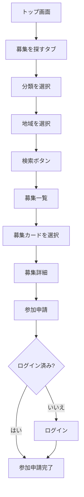
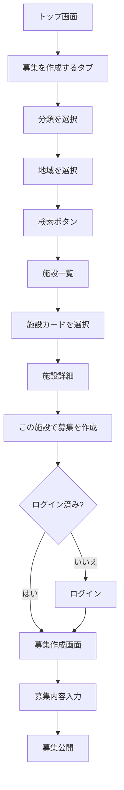
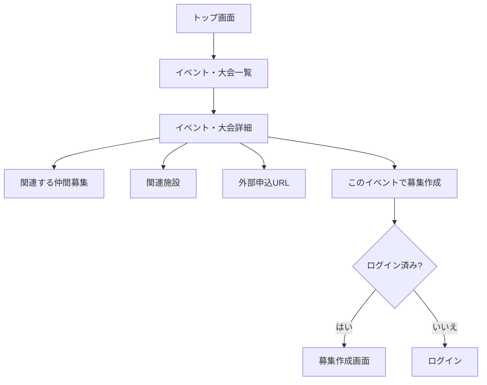
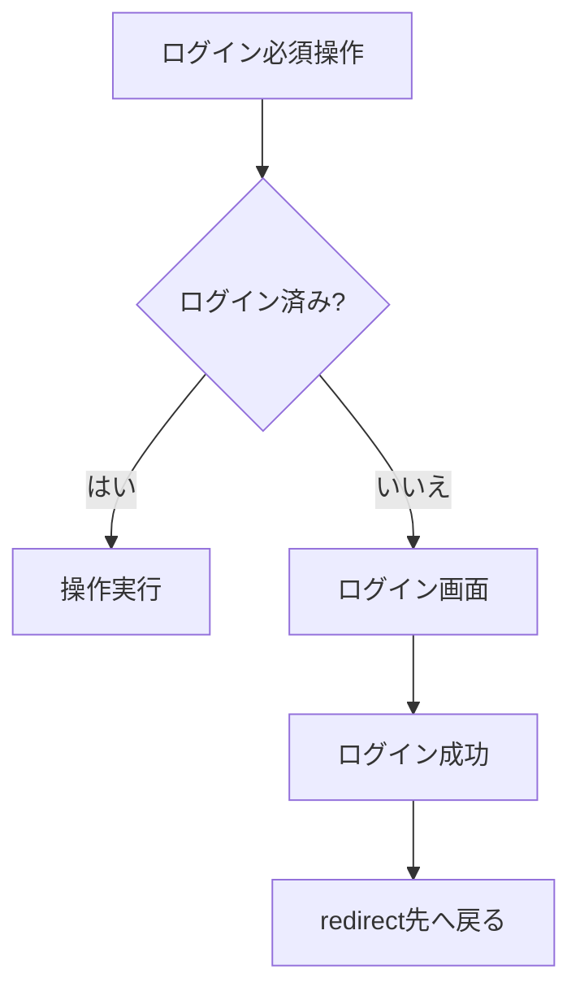
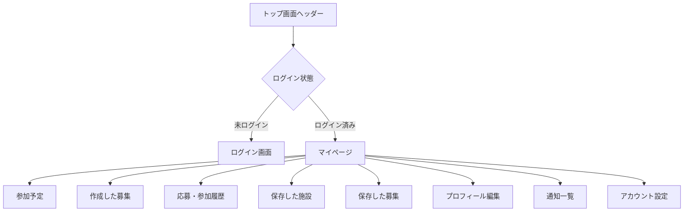
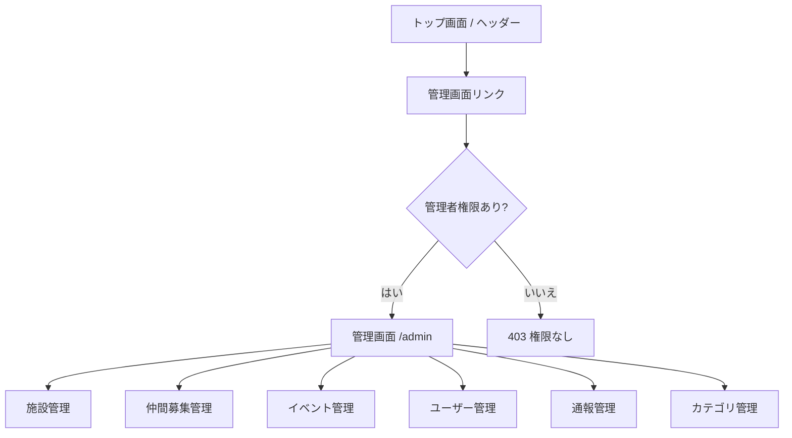
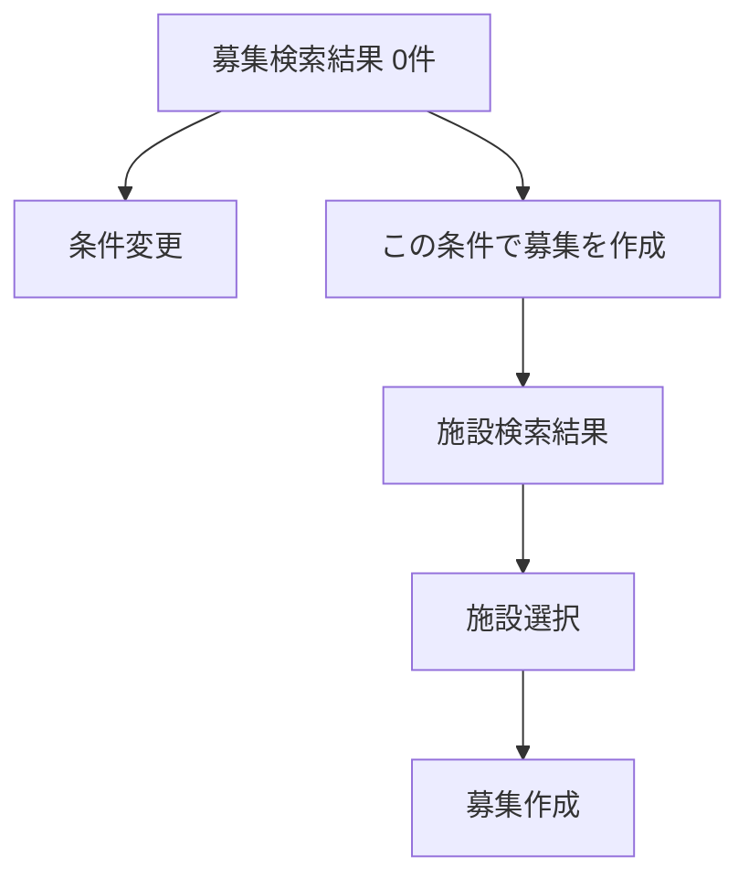
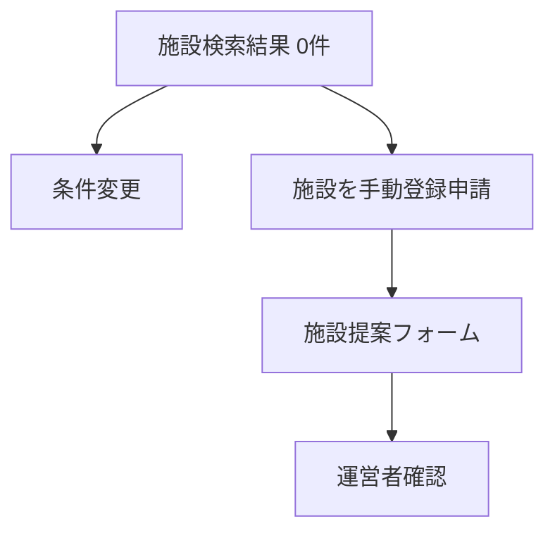

# Spotomo トップ画面開始 画面遷移図 v1.0

## 1. 目的

本資料は、Spotomo のトップ画面を起点とした画面遷移を定義する。

Spotomo は、1つのサイトにスポーツ・レジャーの仲間募集、施設検索、イベント・大会情報を集約する総合サービスである。

今回の更新では、トップ画面の検索目的を以下の2つに明確化する。

1. **募集に参加するための検索**
   - 検索対象：募集データ `recruitments`
   - 検索条件：分類 + 地域
   - 遷移先：募集一覧 → 募集詳細 → 参加申請

2. **募集を作成するための施設検索**
   - 検索対象：施設データ `facilities`
   - 検索条件：分類 + 地域
   - 遷移先：施設一覧 → 施設詳細 → 募集作成

トップ画面検索は、単なる横断検索ではなく、ユーザーの目的を先に分ける **目的別検索導線** として設計する。

---

## 2. 画面一覧

| 画面ID | 画面名 | URL例 | 説明 |
|---|---|---|---|
| S001 | トップ画面 | `/` | サービス入口。募集参加・募集作成の2目的を選択する |
| S002 | 募集検索結果画面 | `/recruitments?category={category}&area={area}` | 募集に参加したいユーザー向けの募集一覧 |
| S003 | 募集詳細画面 | `/recruitments/{recruitment_id}` | 募集内容、日時、場所、参加条件を表示 |
| S004 | 参加申請画面 | `/recruitments/{recruitment_id}/join` | 募集への参加申請 |
| S005 | 施設検索結果画面 | `/facilities?category={category}&area={area}` | 募集を作成したいユーザー向けの施設一覧 |
| S006 | 施設詳細画面 | `/facilities/{facility_id}` | 施設情報、対応分類、所在地、予約URL等を表示 |
| S007 | 募集作成画面 | `/recruitments/new?facility_id={facility_id}` | 選択施設を使って募集を作成 |
| S008 | 種目別トップ画面 | `/sports/{sport_code}` | ゴルフ、ランニング、アウトドア等の種目別ページ |
| S009 | イベント・大会一覧画面 | `/events` | 大会・イベント一覧 |
| S010 | イベント・大会詳細画面 | `/events/{event_id}` | イベント・大会詳細 |
| S011 | ログイン画面 | `/login` | メール、Google、Apple等でログイン |
| S012 | 会員登録画面 | `/signup` | 新規アカウント登録 |
| S013 | マイページ | `/mypage` | 参加予定、作成募集、保存施設、プロフィール管理 |
| S014 | プロフィール編集画面 | `/mypage/profile` | 共通プロフィール・種目別プロフィール編集 |
| S015 | 通知一覧画面 | `/mypage/notifications` | 応募、承認、メッセージ、運営通知 |
| S016 | 管理画面 | `/admin` | 施設、募集、イベント、ユーザー管理 |

---

## 3. トップ画面検索の基本方針

トップ画面の検索フォームは、最初に検索目的を選択する。

```text
[ 募集を探す ] [ 募集を作成する ]
```

またはタブ形式で表示する。

```text
タブ1：募集に参加する
タブ2：募集を作成する
```

検索条件は、両方の目的で共通して以下を基本とする。

```text
分類 + 地域
```

| 検索目的 | 検索対象 | 検索条件 | 検索結果 | 次アクション |
|---|---|---|---|---|
| 募集に参加する | `recruitments` | 分類 + 地域 | 募集一覧 | 参加申請 |
| 募集を作成する | `facilities` | 分類 + 地域 | 施設一覧 | この施設で募集作成 |

---

## 4. トップ画面起点の全体遷移図

```mermaid
flowchart TD
    A[トップ画面 /] --> B{検索目的を選択}

    B -->|募集に参加する| C[分類を選択]
    C --> D[地域を選択]
    D --> E[募集検索結果 /recruitments?category&area]
    E --> F[募集詳細 /recruitments/{id}]
    F --> G[参加申請]
    G --> H{ログイン済み?}
    H -->|はい| I[参加申請完了]
    H -->|いいえ| J[ログイン /login]
    J --> I
    I --> K[マイページ 参加予定]

    B -->|募集を作成する| L[分類を選択]
    L --> M[地域を選択]
    M --> N[施設検索結果 /facilities?category&area]
    N --> O[施設詳細 /facilities/{id}]
    O --> P[この施設で募集作成]
    P --> Q{ログイン済み?}
    Q -->|はい| R[募集作成画面 /recruitments/new?facility_id]
    Q -->|いいえ| S[ログイン /login]
    S --> R
    R --> T[募集内容入力]
    T --> U[募集公開]
    U --> V[募集詳細]
    V --> W[マイページ 作成した募集]

    A --> X[種目別トップ /sports/{sport_code}]
    X --> B

    A --> Y[イベント・大会一覧 /events]
    Y --> Z[イベント・大会詳細]

    A --> AA[ログイン /login]
    A --> AB[会員登録 /signup]
    A --> AC[マイページ /mypage]
```

---

## 5. トップ画面の主要導線

### 5.1 募集に参加する導線

ユーザーが既存の仲間募集を探し、参加申請するための導線である。



#### 検索例

| 分類 | 地域 | 遷移先 |
|---|---|---|
| ゴルフ | 千葉 | `/recruitments?category=golf&area=chiba` |
| ランニング | 東京 | `/recruitments?category=running&area=tokyo` |
| キャンプ | 山梨 | `/recruitments?category=camp&area=yamanashi` |

---

### 5.2 募集を作成する導線

ユーザーが募集を作成する前に、開催場所となる施設を検索する導線である。



#### 検索例

| 分類 | 地域 | 遷移先 |
|---|---|---|
| ゴルフ | 千葉 | `/facilities?category=golf&area=chiba` |
| キャンプ | 山梨 | `/facilities?category=camp&area=yamanashi` |
| テニス | 新宿 | `/facilities?category=tennis&area=shinjuku` |

---

## 6. トップ検索フォーム仕様

### 6.1 UI項目

| 項目 | 種別 | 必須 | 説明 |
|---|---|---:|---|
| 検索目的 | タブ / ラジオ | 必須 | 募集に参加する / 募集を作成する |
| 分類 | セレクト / カテゴリカード | 必須 | ゴルフ、ランニング、アウトドア等 |
| 地域 | セレクト / 入力補完 | 任意 | 都道府県、市区町村、駅名、エリア名 |
| キーワード | テキスト入力 | 任意 | MVPでは任意。タイトル、施設名等の補助検索 |
| 検索ボタン | ボタン | 必須 | 目的に応じて募集一覧または施設一覧へ遷移 |

### 6.2 MVP対象フォーム

MVPでは、以下の3項目を必須実装とする。

```text
検索目的
分類
地域
```

キーワード検索、現在地検索、日付検索は後続対応とする。

---

## 7. 種目別トップ画面からの遷移

種目別トップ画面でも、検索目的はトップ画面と同じ2つに分ける。

例：`/sports/golf`

```mermaid
flowchart TD
    A[種目別トップ /sports/{sport_code}] --> B{目的を選択}

    B -->|募集に参加する| C[地域を選択]
    C --> D[種目別募集一覧 /recruitments?category={sport_code}&area]
    D --> E[募集詳細]
    E --> F[参加申請]

    B -->|募集を作成する| G[地域を選択]
    G --> H[種目別施設一覧 /facilities?category={sport_code}&area]
    H --> I[施設詳細]
    I --> J[この施設で募集作成]
```

種目別ページでは分類が既に確定しているため、検索条件は主に地域となる。

---

## 8. イベント・大会導線

イベント・大会はトップ検索の主目的ではなく、補助導線として扱う。



---

## 9. 未ログイン時・ログイン後の遷移

### 9.1 未ログインでも閲覧可能な画面

未ログインでも以下は閲覧可能とする。

- トップ画面
- 種目別トップ画面
- 募集検索結果
- 募集詳細
- 施設検索結果
- 施設詳細
- イベント・大会一覧
- イベント・大会詳細

### 9.2 ログインが必要な操作

以下の操作はログイン必須とする。

| 操作 | 未ログイン時の遷移 |
|---|---|
| 参加申請 | `/login?redirect=/recruitments/{id}` |
| 仲間募集作成 | `/login?redirect=/recruitments/new?facility_id={id}` |
| 施設保存 | `/login?redirect=/facilities/{id}` |
| 募集保存 | `/login?redirect=/recruitments/{id}` |
| メッセージ送信 | `/login?redirect=/messages` |
| プロフィール編集 | `/login?redirect=/mypage/profile` |
| マイページ表示 | `/login?redirect=/mypage` |



---

## 10. マイページへの遷移



---

## 11. 管理画面への遷移

管理者権限を持つユーザーのみ、管理画面へ遷移できる。



---

## 12. URL設計

### 12.1 トップ検索からのURL

| 目的 | URL | 説明 |
|---|---|---|
| 募集に参加する | `/recruitments?category={category}&area={area}` | 分類・地域に合う募集一覧 |
| 募集を作成する | `/facilities?category={category}&area={area}` | 分類・地域に合う施設一覧 |

### 12.2 基本URL一覧

| 種別 | URL | 説明 |
|---|---|---|
| トップ | `/` | サービス入口 |
| 種目別トップ | `/sports/{sport_code}` | 種目別入口 |
| 募集一覧 | `/recruitments` | 仲間募集一覧 |
| 募集詳細 | `/recruitments/{recruitment_id}` | 仲間募集詳細 |
| 参加申請 | `/recruitments/{recruitment_id}/join` | 参加申請 |
| 施設一覧 | `/facilities` | 施設一覧 |
| 施設詳細 | `/facilities/{facility_id}` | 施設詳細 |
| 募集作成 | `/recruitments/new` | 募集作成 |
| イベント一覧 | `/events` | イベント・大会一覧 |
| イベント詳細 | `/events/{event_id}` | イベント・大会詳細 |
| ログイン | `/login` | ログイン |
| 会員登録 | `/signup` | 会員登録 |
| マイページ | `/mypage` | マイページ |
| プロフィール編集 | `/mypage/profile` | プロフィール編集 |
| 通知 | `/mypage/notifications` | 通知一覧 |
| 管理画面 | `/admin` | 管理画面 |

---

## 13. トップ画面CTA設計

| CTA | 表示場所 | 目的 | 遷移先 | ログイン要否 |
|---|---|---|---|---|
| 募集を探す | ヒーロー検索タブ | 参加する募集を探す | `/recruitments?category=&area=` | 不要 |
| 募集を作成する | ヒーロー検索タブ | 募集場所となる施設を探す | `/facilities?category=&area=` | 不要 |
| 参加申請 | 募集詳細 | 募集に参加する | `/recruitments/{id}/join` | 必要 |
| この施設で募集作成 | 施設詳細 | 施設を指定して募集作成 | `/recruitments/new?facility_id={id}` | 必要 |
| ゴルフを見る | カテゴリ | 種目別ページへ遷移 | `/sports/golf` | 不要 |
| ランニングを見る | カテゴリ | 種目別ページへ遷移 | `/sports/running` | 不要 |
| アウトドアを見る | カテゴリ | 種目別ページへ遷移 | `/sports/outdoor` | 不要 |
| ログイン | ヘッダー | ログイン | `/login` | 不要 |
| マイページ | ヘッダー | ユーザー管理 | `/mypage` | 必要 |

---

## 14. 空結果時の遷移

### 14.1 募集検索で0件の場合



表示文例：

```text
この条件の募集はまだありません。
近くの施設を選んで、あなたが募集を作成できます。
```

### 14.2 施設検索で0件の場合



表示文例：

```text
該当する施設が見つかりません。
条件を変更するか、新しい施設を提案してください。
```

---

## 15. API設計

### 15.1 募集参加用検索API

```http
GET /api/recruitments?category={category}&area={area}
```

検索対象：

```text
recruitments
recruitment_participants
facilities
sports
areas
users
```

### 15.2 募集作成用施設検索API

```http
GET /api/facilities?category={category}&area={area}
```

検索対象：

```text
facilities
facility_sports
facility_categories
areas
facility_sources
```

---

## 16. MVPで実装する画面遷移

MVPでは、以下の2大導線を優先実装する。

### 16.1 募集に参加する導線

```text
トップ画面
  ↓
募集を探す
  ↓
分類 + 地域
  ↓
募集一覧
  ↓
募集詳細
  ↓
参加申請
```

### 16.2 募集を作成する導線

```text
トップ画面
  ↓
募集を作成する
  ↓
分類 + 地域
  ↓
施設一覧
  ↓
施設詳細
  ↓
この施設で募集作成
  ↓
募集公開
```

### 16.3 MVP対象外または後続対応

- キーワードによる高度検索
- 現在地検索
- 日付検索
- メッセージ機能
- 通報管理
- 施設管理者申請
- 高度なイベント・大会連携
- レビュー機能
- 決済機能
- 外部予約APIとのリアルタイム連携

---

## 17. 受け入れ条件

- トップ画面で「募集を探す」と「募集を作成する」を選択できること。
- 「募集を探す」では、分類 + 地域で募集データを検索し、募集一覧に遷移できること。
- 「募集を作成する」では、分類 + 地域で施設データを検索し、施設一覧に遷移できること。
- 募集詳細から参加申請へ進めること。
- 施設詳細から募集作成へ進めること。
- 参加申請と募集作成はログイン必須であること。
- 未ログイン時はログイン後に元の操作へ戻れること。
- 種目別トップでも同じ目的別検索導線を利用できること。

---

## 18. 関連設計書

本画面遷移図は、以下の設計書と整合する。

- Spotomo 1サイト集約仕様書 v1.0
- Spotomo トップ画面設計書 v1.0
- Spotomo トップ画面検索目的・検索導線設計書 v1.0
- Spotomo 種目単位画面設計書 v1.0
- Spotomo マイページ画面設計書 v1.0
- スポーツ・レジャー施設データ取得・登録設計書 v1.2

本設計では、トップ画面を総合入口としながら、検索目的を「募集に参加する」と「募集を作成する」に分けることで、ユーザーの行動を明確にする。
