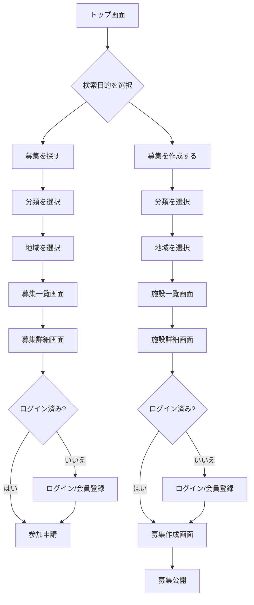

# Spotomo トップ画面検索目的・検索導線設計書 v1.0

## 1. 文書情報

| 項目 | 内容 |
|---|---|
| 文書名 | Spotomo トップ画面検索目的・検索導線設計書 |
| バージョン | v1.0 |
| 対象サービス | Spotomo：スポーツ・レジャー仲間募集プラットフォーム |
| 前提方針 | 1つのサイト、1つのアカウント、1つの施設DB、1つの管理画面に集約 |
| 作成目的 | トップ画面検索の目的を明確化し、募集参加・募集作成の2導線を設計する |

---

## 2. 背景

Spotomo は、ゴルフ、ランニング、アウトドア、球技、フィットネス、レジャーなど、複数のスポーツ・レジャーを1つのサイトに集約するサービスである。

トップ画面には検索機能を配置するが、検索目的を曖昧にすると、以下の問題が発生する。

- ユーザーが「募集を探したい」のか「施設を探したい」のか分かりにくい
- 募集参加用の検索結果と、募集作成用の施設検索結果が混在する
- 施設検索サイトのように見えてしまい、仲間募集サービスとしての主目的が弱くなる
- トップ画面から次の行動へ進みにくい

そのため、トップ画面検索の目的を以下の2つに明確に分ける。

```text
目的1：募集に参加するため、募集データを検索する
目的2：募集を作成するため、施設データを検索する
```

---

## 3. 基本方針

トップ画面検索は、以下の2目的を選択できるUIとする。

| 検索目的 | ユーザーの意図 | 検索対象 | 検索結果 | 次の行動 |
|---|---|---|---|---|
| 募集を探す | 既存の仲間募集に参加したい | 募集データ | 募集一覧 | 募集詳細 → 参加申請 |
| 募集を作成する | 新しく仲間募集を作りたい | 施設データ | 施設一覧 | 施設選択 → 募集作成 |

検索条件は、両方の目的で共通して **分類 + 地域** を基本とする。

```text
分類：ゴルフ、ランニング、キャンプ、登山、テニスなど
地域：都道府県、市区町村、駅名、エリア名など
```

---

## 4. トップ画面検索の目的定義

### 4.1 募集に参加するための検索

#### 目的

ユーザーが、参加可能な仲間募集を探すための検索である。

#### 検索対象

`recruitments` を中心に検索する。

関連テーブル：

```text
recruitments
recruitment_participants
facilities
sports
areas
users
```

#### 検索例

| 分類 | 地域 | 表示結果 |
|---|---|---|
| ゴルフ | 千葉 | 千葉県のゴルフ仲間募集一覧 |
| ランニング | 東京 | 東京都のランニング募集一覧 |
| キャンプ | 山梨 | 山梨県のキャンプ仲間募集一覧 |
| テニス | 横浜 | 横浜周辺のテニス募集一覧 |

#### 画面遷移

```text
トップ画面
↓
検索目的：募集を探す
↓
分類・地域を選択
↓
募集一覧画面
↓
募集詳細画面
↓
参加申請
```

---

### 4.2 募集を作成するための施設検索

#### 目的

ユーザーが、新しい仲間募集を作成する際に、開催場所となる施設を探すための検索である。

#### 検索対象

`facilities` を中心に検索する。

関連テーブル：

```text
facilities
facility_sports
facility_categories
facility_sources
areas
```

#### 検索例

| 分類 | 地域 | 表示結果 |
|---|---|---|
| ゴルフ | 千葉 | 千葉県のゴルフ場・ゴルフ練習場一覧 |
| キャンプ | 山梨 | 山梨県のキャンプ場一覧 |
| ランニング | 東京 | 東京都のランニングコース・陸上競技場一覧 |
| テニス | 横浜 | 横浜周辺のテニスコート一覧 |

#### 画面遷移

```text
トップ画面
↓
検索目的：募集を作成する
↓
分類・地域を選択
↓
施設一覧画面
↓
施設詳細画面
↓
この施設で募集を作成
↓
募集作成画面
↓
募集公開
```

---

## 5. 検索UI設計

### 5.1 表示方式

トップ画面の検索エリアは、タブ形式で検索目的を切り替える。

```text
[ 募集を探す ] [ 募集を作成する ]

分類を選択
地域を選択
検索する
```

### 5.2 タブ仕様

| タブ | 内部値 | 検索対象 | 遷移先 |
|---|---|---|---|
| 募集を探す | `join` | 募集データ | 募集一覧画面 |
| 募集を作成する | `create` | 施設データ | 施設一覧画面 |

### 5.3 入力項目

| 項目 | 内容 | 必須 | MVP |
|---|---|---:|---:|
| 検索目的 | 募集を探す / 募集を作成する | 必須 | 対象 |
| 分類 | スポーツ・レジャーカテゴリ | 必須 | 対象 |
| 地域 | 都道府県、市区町村、駅名、エリア | 任意 | 対象 |
| キーワード | 募集タイトル、施設名など | 任意 | 後続 |
| 日付 | 開催日・利用予定日 | 任意 | 後続 |
| 人数 | 募集人数・空き人数 | 任意 | 後続 |

MVPでは、以下の3項目を優先実装する。

```text
検索目的
分類
地域
```

---

## 6. 分類設計

分類は、スポーツ・レジャーの大分類・小分類を持つ。

### 6.1 大分類

| 大分類コード | 表示名 | 例 |
|---|---|---|
| `golf` | ゴルフ | ゴルフ場、ゴルフ練習場 |
| `running` | ランニング・マラソン | ランニング、マラソン、陸上競技 |
| `outdoor` | アウトドア | キャンプ、登山、釣り、BBQ |
| `ball_sports` | 球技 | サッカー、フットサル、野球、バスケ |
| `tennis` | テニス | テニスコート、テニス仲間募集 |
| `fitness` | フィットネス | ジム、ヨガ、ダンス |
| `water_sports` | 水泳・水辺スポーツ | プール、SUP、カヤック |
| `winter_sports` | ウィンタースポーツ | スキー、スノーボード |
| `leisure` | レジャー | ボウリング、ダーツ、カラオケ |

### 6.2 小分類例

| 大分類 | 小分類例 |
|---|---|
| ゴルフ | ゴルフ場、ゴルフ練習場、ゴルフコンペ |
| ランニング | ランニング、マラソン、陸上競技場、ランニングコース |
| アウトドア | キャンプ、登山、釣り、BBQ、ハイキング |
| 球技 | サッカー、フットサル、野球、バスケットボール、バレーボール |
| フィットネス | ジム、ヨガ、ピラティス、ダンス |

---

## 7. 地域設計

地域は、検索対象によって意味が変わる。

| 検索目的 | 地域の意味 |
|---|---|
| 募集を探す | 募集の開催地域、施設所在地 |
| 募集を作成する | 施設の所在地 |

### 7.1 地域指定レベル

```text
都道府県
市区町村
駅名
エリア名
```

### 7.2 地域入力例

```text
東京都
新宿区
渋谷
横浜市
千葉県
山梨県
大宮
```

### 7.3 現在地検索の扱い

現在地検索は主機能ではなく、補助機能とする。

```text
主機能：分類 + 地域で探す
補助機能：現在地周辺で探す
```

---

## 8. 検索結果画面設計

### 8.1 募集を探す場合の検索結果

#### 画面名

募集一覧画面

#### URL例

```text
/search/recruitments?category=golf&area=chiba
```

または種目別URL：

```text
/golf/recruitments?area=chiba
```

#### 表示カード項目

```text
募集タイトル
分類
開催日
開催地域
施設名
募集人数
参加人数
主催者
初心者歓迎フラグ
性別・年齢条件
参加申請ボタン
```

#### 並び順

MVPでは以下を基本とする。

```text
開催日が近い順
新着順
空き人数あり優先
```

---

### 8.2 募集を作成する場合の検索結果

#### 画面名

施設一覧画面

#### URL例

```text
/search/facilities?category=camp&area=yamanashi&purpose=create
```

または種目別URL：

```text
/camp/facilities?area=yamanashi&purpose=create
```

#### 表示カード項目

```text
施設名
分類
住所
地域
写真
営業時間
公式サイトURL
予約URL
駐車場有無
トイレ有無
この施設で募集を作成するボタン
```

#### 並び順

MVPでは以下を基本とする。

```text
地域一致度が高い順
カテゴリ一致度が高い順
情報確認済み優先
公開施設優先
```

---

## 9. 画面遷移図



---

## 10. API設計

### 10.1 トップ検索API案

トップ画面から共通検索APIに送信し、目的に応じてバックエンド側で検索対象を切り替える。

```http
GET /api/search/top?purpose=join&category=golf&area=chiba
```

```http
GET /api/search/top?purpose=create&category=camp&area=yamanashi
```

#### パラメータ

| パラメータ | 内容 | 必須 | 例 |
|---|---|---:|---|
| `purpose` | 検索目的 | 必須 | `join`, `create` |
| `category` | 分類コード | 必須 | `golf`, `camp`, `running` |
| `area` | 地域コードまたは地域名 | 任意 | `chiba`, `yamanashi`, `tokyo` |
| `keyword` | 任意キーワード | 任意 | `初心者`, `週末` |

#### purpose値

| 値 | 意味 | 検索対象 |
|---|---|---|
| `join` | 募集を探す | `recruitments` |
| `create` | 募集を作成する | `facilities` |

---

### 10.2 募集検索API

```http
GET /api/recruitments/search?category=golf&area=chiba
```

#### レスポンス例

```json
{
  "items": [
    {
      "id": 101,
      "title": "週末ゴルフ仲間募集",
      "category": "golf",
      "event_date": "2026-07-12",
      "area_name": "千葉県",
      "facility_name": "〇〇ゴルフクラブ",
      "capacity": 4,
      "participant_count": 2,
      "beginner_welcome": true
    }
  ],
  "total": 1
}
```

---

### 10.3 施設検索API

```http
GET /api/facilities/search?category=camp&area=yamanashi&purpose=create
```

#### レスポンス例

```json
{
  "items": [
    {
      "id": 501,
      "name": "〇〇キャンプ場",
      "category": "camp",
      "address": "山梨県〇〇市...",
      "area_name": "山梨県",
      "website_url": "https://example.com",
      "reservation_url": "https://example.com/reserve",
      "has_parking": true,
      "has_toilet": true,
      "verified": true
    }
  ],
  "total": 1
}
```

---

## 11. URL設計

### 11.1 トップ検索後URL

| 目的 | URL |
|---|---|
| 募集を探す | `/search/recruitments?category={category}&area={area}` |
| 募集を作成する | `/search/facilities?category={category}&area={area}&purpose=create` |

### 11.2 種目別URL案

| 目的 | URL |
|---|---|
| ゴルフ募集を探す | `/golf/recruitments?area=chiba` |
| ゴルフ施設を探す | `/golf/facilities?area=chiba&purpose=create` |
| キャンプ募集を探す | `/outdoor/recruitments?sub_category=camp&area=yamanashi` |
| キャンプ施設を探す | `/outdoor/facilities?sub_category=camp&area=yamanashi&purpose=create` |

### 11.3 募集作成URL

施設を選択した後、施設IDを付与して募集作成画面に遷移する。

```text
/recruitments/new?facility_id=501&category=camp
```

---

## 12. DB設計への影響

### 12.1 募集検索で利用する主な項目

```text
recruitments.id
recruitments.title
recruitments.category_code
recruitments.sport_code
recruitments.facility_id
recruitments.event_date
recruitments.area_code
recruitments.capacity
recruitments.status
facilities.name
facilities.prefecture
facilities.city
users.display_name
```

### 12.2 施設検索で利用する主な項目

```text
facilities.id
facilities.name
facilities.category_code
facilities.address
facilities.prefecture
facilities.city
facilities.latitude
facilities.longitude
facilities.website_url
facilities.reservation_url
facilities.verified
facility_sports.sport_code
facility_categories.category_code
```

### 12.3 推奨インデックス

```sql
CREATE INDEX idx_recruitments_category_area
ON recruitments(category_code, area_code, status);

CREATE INDEX idx_recruitments_event_date
ON recruitments(event_date);

CREATE INDEX idx_facilities_category_area
ON facilities(category_code, prefecture, city, status);

CREATE INDEX idx_facility_sports_sport
ON facility_sports(sport_code, facility_id);
```

PostGISを利用する場合：

```sql
CREATE INDEX idx_facilities_location
ON facilities
USING GIST (geom);
```

---

## 13. 空結果時の表示

### 13.1 募集を探す場合

募集が見つからない場合、施設検索と募集作成へ誘導する。

```text
該当する募集はまだありません。
この地域・分類で新しく募集を作成してみませんか？
[施設を探して募集を作成する]
```

### 13.2 募集を作成する場合

施設が見つからない場合、施設提案・手動登録へ誘導する。

```text
該当する施設が見つかりませんでした。
施設名や住所を入力して、新しい施設を提案できます。
[施設を提案する]
```

---

## 14. ログイン制御

### 14.1 未ログインでも可能な操作

```text
トップ画面閲覧
募集検索
募集一覧閲覧
募集詳細閲覧
施設検索
施設一覧閲覧
施設詳細閲覧
```

### 14.2 ログインが必要な操作

```text
募集への参加申請
募集作成
施設提案
お気に入り保存
メッセージ送信
```

---

## 15. 画面文言案

### 15.1 検索エリア見出し

```text
何をしますか？
```

### 15.2 タブ文言

```text
募集を探す
募集を作成する
```

### 15.3 フォーム文言

募集を探す場合：

```text
参加したい分類と地域を選んでください
```

募集を作成する場合：

```text
募集を開催する分類と地域を選んで、施設を探してください
```

### 15.4 ボタン文言

| 状態 | ボタン |
|---|---|
| 募集を探す | 募集を検索する |
| 募集を作成する | 施設を検索する |

---

## 16. MVP実装範囲

MVPでは以下を実装対象とする。

```text
トップ画面検索タブ
分類選択
地域選択
募集検索
施設検索
募集一覧画面
施設一覧画面
施設詳細から募集作成画面への遷移
未ログイン時のログイン誘導
```

以下は後続対応とする。

```text
キーワード検索
日付検索
人数検索
駅名検索
現在地検索
AIによる目的判定
検索履歴
おすすめ検索
```

---

## 17. 受け入れ条件

| No | 条件 |
|---|---|
| 1 | トップ画面で「募集を探す」「募集を作成する」を選択できる |
| 2 | 「募集を探す」では募集データのみ検索される |
| 3 | 「募集を作成する」では施設データのみ検索される |
| 4 | 検索条件は分類 + 地域を基本とする |
| 5 | 募集検索結果から募集詳細へ遷移できる |
| 6 | 募集詳細から参加申請へ進める |
| 7 | 施設検索結果から施設詳細へ遷移できる |
| 8 | 施設詳細から募集作成画面へ進める |
| 9 | 未ログイン時は参加申請・募集作成前にログインへ誘導される |
| 10 | 空結果時に次の行動導線が表示される |

---

## 18. 結論

トップ画面検索は、以下の2目的に分けて設計する。

```text
1. 募集に参加する
   → 募集データを検索する

2. 募集を作成する
   → 施設データを検索する
```

検索条件は、両方とも以下を基本とする。

```text
分類 + 地域
```

これにより、トップ画面の検索目的が明確になり、ユーザーは迷わず次の行動へ進める。

```text
参加したい人 → 募集一覧へ
募集を作りたい人 → 施設一覧へ
```
